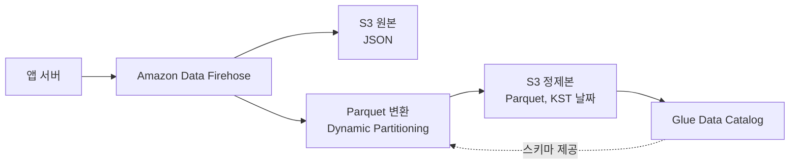
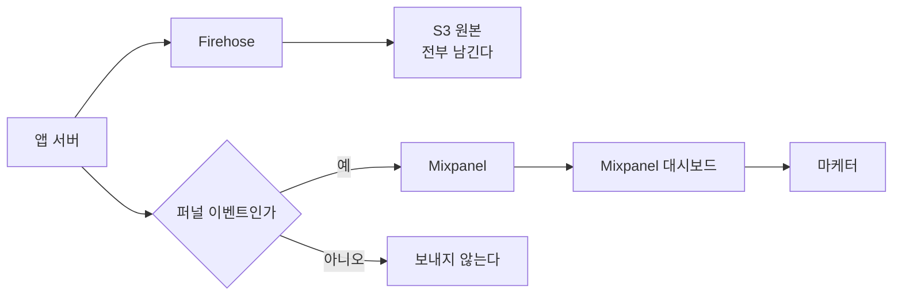
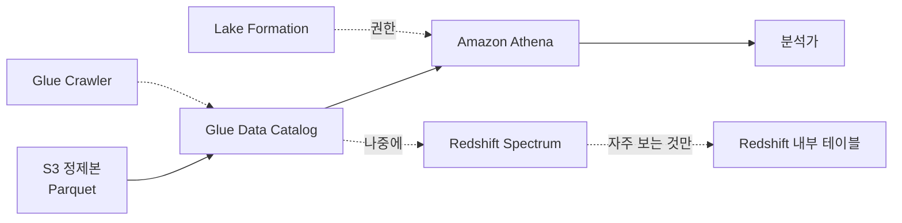
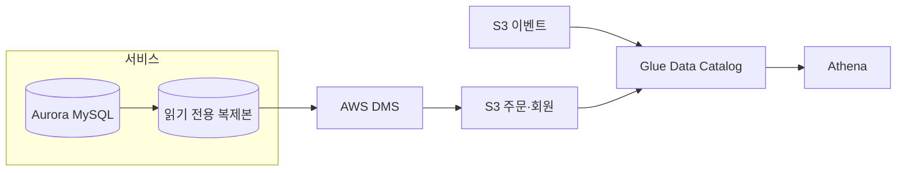
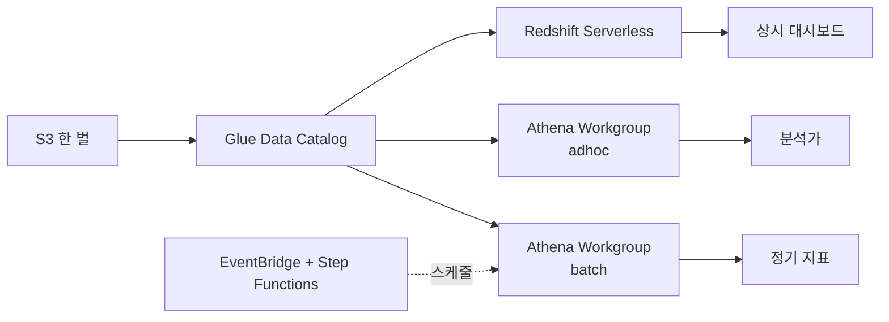

[1편](/posts/2026-09-16-analytics-tools-first-look/)에서 요구사항만 놓고 처음부터 세워보기로 했고,
[2편](/posts/2026-09-16-snowflake-world-tour/)에서 이미 굴리는 회사들 이야기를 들었다.

이제 실제로 그려볼 차례인데, 첫 칸에서 바로 걸렸다.

"셋 중에 뭘 도입할까"를 1편 내내 물었는데,
이벤트를 어디에 쌓을지는 애초에 고를 일이 아니었다.

## 원본을 어디에 쌓을지는 판단이 아니었다

서비스가 이미 AWS 위에 있다. 애플리케이션 로그도, DB 백업도 이미 S3로 간다.
버킷 정책도, 수명 주기 규칙도, 비용이 어디서 나오는지도 이미 아는 상태다.

여기에 별도의 저장소를 하나 더 들이면 늘어나는 건 데이터가 아니라 관리 대상이다.
권한 체계가 하나 더 생기고, 비용 청구서가 하나 더 오고,
장애 났을 때 누구한테 물어봐야 하는지가 하나 더 늘어난다.

그래서 원본은 **Amazon S3**에 쌓는다.
이건 판단이라기보다 이미 그렇게 되어 있는 것에 가깝다.

다만 다른 선택지를 안 본 건 아니라서, 왜 아닌지는 적어둔다.

| 대신 할 수 있었던 것 | 왜 기본으로 두지 않았나 |
|---|---|
| Mixpanel로 바로 전송 | 붙이는 건 제일 빠르다. 그런데 원본이 우리 쪽에 안 남는다. 도구를 바꾸는 날 과거 데이터를 어떻게 꺼낼지가 그때 가서 문제가 된다 |
| Redshift에 바로 적재 | 컬럼을 먼저 정해야 한다. 지금은 이벤트에 필드가 매주 붙는 단계라, 정하는 족족 다시 고치게 된다 |
| Amazon MSK에 오래 보관 | 큐는 흘려보내는 곳이지 뒤지는 곳이 아니다. 3주 전 걸 보려면 결국 어딘가에 내려놓아야 한다 |

원본을 우리 쪽에 두면 도구를 갈아치워도 과거가 남는다.
이게 S3를 기본으로 두는 진짜 이유다. 비용이 싸서가 아니다.

## 대신 S3 안에서 정할 게 있었다

"S3에 쌓는다"까지는 한 문장인데, 막상 쌓으려니 정할 게 나왔다.
그리고 이걸 안 정하고 쌓으면 나중에 전부 다시 쓰게 된다.

**들어오는 대로 JSON으로 둘 것인가.**
그러면 나중에 컬럼 하나 세려고 파일 전체를 읽는다.
Parquet으로 바꿔두면 필요한 컬럼만 읽는다.
Athena는 읽은 양으로 돈을 받으니, 이 차이가 그대로 청구서가 된다.

**폴더를 어떻게 자를 것인가.**
`dt=2026-09-17/` 처럼 날짜로 나눠야 어제 것만 볼 때 어제 것만 읽는다.
안 나누고 한 폴더에 다 넣으면, 하루치를 보려고 지금까지 쌓인 전부를 읽는다.

**그 날짜를 어느 시간대로 자를 것인가.**
이건 전에 한 번 데인 적이 있다.
Firehose가 기본으로 만드는 폴더는 UTC 기준이다.
그대로 두면 "9월 17일 매출"이 폴더 두 개에 걸치고,
아침에 나온 숫자와 사람이 말하는 하루가 아홉 시간 어긋난다.
KST로 자르려면 **Dynamic Partitioning**으로 레코드에서 직접 키를 뽑아 써야 한다.

**얼마나 모아서 파일 하나로 쓸 것인가.**
Firehose 버퍼를 짧게 잡으면 작은 파일이 하루에 수만 개 생긴다.
2편에서 들었던 이야기가 정확히 이 지점이었다. 파일을 여는 비용이 읽는 비용보다 커진다.

이 자리에 무엇을 놓을 수 있는지 정리하면 이렇다.

| 자리 | 1순위 | 다른 후보 | 왜 1순위인가 |
|---|---|---|---|
| 수집 지점 | 기존 앱 서버 | API Gateway + Lambda | 이미 있는 걸 쓴다. 트래픽이 앱과 갈라질 때 떼면 된다 |
| 버퍼와 전송 | Amazon Data Firehose | Kinesis Data Streams, Amazon MSK + S3 Sink | 버퍼링·Parquet 변환·파티션을 한 덩어리로 해준다. 운영할 게 없다 |
| 원본 보관 | S3 Standard | — | 이미 쓰고 있다 |
| 형식 변환 | Firehose 레코드 포맷 변환 | AWS Glue ETL, Lambda | 별도 잡을 안 만들어도 된다. 대신 Glue에 스키마가 먼저 있어야 한다 |
| 테이블 목록 | AWS Glue Data Catalog | Hive Metastore 직접 운영 | Athena·Redshift·EMR이 같은 걸 본다 |

Firehose 대신 MSK를 놓는 경우는 따로 있다.
이벤트를 S3 말고 다른 곳으로도 동시에 보내야 하거나,
순서를 지켜 읽어야 하거나, 재처리를 위해 되감아야 할 때다.
지금은 그 요구가 없어서 운영 대상이 하나 더 느는 쪽을 택하지 않았다.

여기까지가 전제다. 이 그림은 앞으로 나올 모든 경우에 공통으로 깔린다.
갈리는 건 `Glue Data Catalog` 오른쪽부터다.

## 진짜 갈림길은 그다음이었다

쌓아놓고 나니 질문이 바뀌었다.
"뭘 도입할까"가 아니라 **"누가 무엇을 물어보는가"** 였다.

같은 S3를 두고도, 묻는 사람이 다르면 그 뒤에 붙일 게 완전히 달라진다.

| 지금 벌어지는 일 | 이게 어떤 문제인가 | 붙일 자리 |
|---|---|---|
| 마케터가 매일 아침 같은 숫자를 묻는다 | 질문이 고정돼 있다. 계산이 아니라 보여주기 문제다 | 경우 하나 |
| "이 쿠폰 쓴 사람들이 그전에 뭘 봤나" 같은 게 주마다 새로 들어온다 | 질문을 미리 못 정한다. 대시보드로는 못 막는다 | 경우 둘 |
| "이 화면 본 사람이 결제까지 갔나"를 이벤트만으로 못 센다 | 답이 두 군데에 나뉘어 있다 | 경우 셋 |
| 야간 집계가 아직 도는데 아침에 분석가가 쿼리를 던진다 | 성격이 다른 작업이 같은 자원을 쓴다 | 경우 넷 |

넷을 한 번에 풀려고 하면 아무것도 못 정한다.
그래서 각각 따로 그려봤다.

## 경우 하나 — 매일 같은 숫자를, SQL을 안 쓰는 사람이 본다

어제 가입 몇 명, 그중 결제까지 간 비율, 이번 주 이탈 지점.
매일 같은 걸 묻고, 묻는 사람은 쿼리를 안 쓴다.

여기에 조회 엔진을 붙이는 건 방향이 틀렸다.
질문이 정해져 있으면 그건 계산이 어려운 게 아니라 **꺼내 보여주는 게 없는 것**이다.

그래서 제품 분석 도구를 붙이되,
**S3에서 꺼내 넣는 게 아니라 수집 지점에서 한 번 더 보낸다.**

| 자리 | 1순위 | 다른 후보 | 갈리는 지점 |
|---|---|---|---|
| 제품 분석 도구 | Mixpanel | Amplitude, GA4, PostHog | 퍼널·리텐션 화면이 바로 있는가 |
| 분기 지점 | 앱 서버 | Firehose 변환 Lambda | 이벤트를 고를 판단이 코드에 있는가 |
| 안 붙이고 버틴다면 | Amazon QuickSight + Athena | Metabase, Superset | 매번 SQL을 짜줄 사람이 있는가 |

QuickSight로도 같은 숫자를 만들 수는 있다.
그런데 퍼널을 하나 만들려면 SQL을 짜야 하고, 기간을 바꾸면 또 짜야 한다.
그러면 "보는 사람이 직접 본다"가 안 된다. 결국 내가 매번 불려간다.
Mixpanel을 붙이는 값은 계산이 아니라 **나를 안 거치게 만드는 것**에 있다.

왜 S3를 거치지 않는가.
제품 분석 도구는 이벤트가 들어오는 순간 사용자별로 묶어두는 구조라,
나중에 파일로 밀어넣는 경로보다 실시간 경로가 훨씬 자연스럽다.
Mixpanel도 Amplitude도 S3에서 당겨오는 기능이 있긴 한데 대체로 상위 요금제 쪽이다.

대신 **전부 보내지 않는다.** 이게 이 설계의 핵심이다.
제품 분석 도구는 대부분 이벤트 수로 돈을 받는다.
서버가 찍는 로그성 이벤트까지 다 보내면 청구서가 몇 배가 된다.
퍼널에 실제로 쓰는 것만 골라서 보낸다. 나머지는 S3에만 남는다.

2편 첫 번째 사례가 여기에 걸린다.
비용이 문제인 줄 알았는데 계산하는 쪽과 보여주는 쪽이 안 나뉜 게 문제였다는 이야기.
매일 같은 숫자를 본다면 그건 보여주기 문제다. 계산 자원을 늘릴 일이 아니다.

## 경우 둘 — 매번 다른 질문을, SQL 쓰는 사람이, 가끔 한다

"이 쿠폰 쓴 사람들이 그전에 어떤 화면을 봤나."
다음 주엔 또 다른 게 들어온다. 미리 대시보드로 만들어둘 수가 없다.

여기서 Redshift를 떠올렸는데, 다시 보니 이르다.
웨어하우스를 도입한다는 건 클러스터 하나가 아니라
적재 파이프라인 + 스키마 관리 + 그걸 돌보는 사람이 같이 오는 것이다.
질문이 하루에 몇 번 들어오는 상태에서 그건 과하다.

그래서 **적재하지 않는다.** S3 위에 테이블 정의만 얹고 그대로 조회한다.

| 자리 | 1순위 | 다른 후보 | 갈리는 지점 |
|---|---|---|---|
| 조회 엔진 | Amazon Athena | Redshift Spectrum, Redshift Serverless | 쓰지 않는 시간에 돈이 나가도 되는가 |
| 테이블 정의 | Glue Crawler | 수동 DDL | 스키마가 자주 바뀌는가 |
| 권한 | AWS Lake Formation | S3 버킷 정책 + IAM | 테이블·컬럼 단위로 잘라야 하는가 |
| 쿼리 창구 | Athena 콘솔 | Metabase, Redash를 Athena에 연결 | 결과를 남에게 보여줘야 하는가 |
| 나중에 | Redshift로 적재 | Snowflake External Table + Snowpipe | 이미 AWS 밖으로 나갈 이유가 있는가 |

Athena를 1순위로 둔 이유는 하나다.
**데이터를 옮기지 않고 제자리에서 읽고, 안 쓰는 날은 돈이 안 나간다.**
클러스터를 띄우면 질문이 없는 날에도 요금이 붙는다.
질문이 주에 몇 번인 단계에서 그 차이는 작지 않다.

한계도 같이 적어둔다.
같은 걸 하루에 수십 번 물으면 매번 같은 파일을 다시 읽고 매번 스캔 비용을 낸다.
그때가 저 점선을 실선으로 바꿀 시점이다.
Redshift Spectrum으로 S3를 그대로 보다가, 자주 보는 것만 골라 내부 테이블로 넣는다.
전부 옮기지 않는다는 게 요점이다.

2편 세 번째 사례가 여기서 쓸모가 있었다. 경계를 먼저 고정한다는 이야기.
어디까지가 손대지 않는 원본이고 어디부터가 정제본인지를 지금 정해두면,
나중에 엔진을 바꿔도 Glue Data Catalog가 가리키는 곳만 다시 맞추면 된다.
엔진이 바뀔 때마다 데이터를 복사해 옮기는 일이 안 생긴다.

## 경우 셋 — 이벤트만으로는 답이 안 나온다

"이 화면 본 사람이 실제로 결제까지 갔나."
S3에는 화면을 봤다는 이벤트가 있고, 결제했다는 사실은 운영 DB에 있다.
둘을 붙여야 답이 나온다.

제일 쉬운 건 운영 DB에 직접 조인하는 것이다. 그런데 그건 안 한다.
한 번 크게 도는 집계가 주문 조회를 몇 초씩 밀어내는 걸 본 적이 있다.
읽는 쪽이 서비스를 미는 구조는 언젠가 반드시 터진다.

그래서 운영 DB 쪽을 같은 저장소로 데려온다.

둘 중 뭘 쓸지는 **얼마나 최신이어야 하는가**로 갈린다.

| 기준 | 야간 스냅샷 | 변경 로그 수집 |
|---|---|---|
| 무엇으로 | DMS Full Load, S3 타깃 | DMS CDC 모드, S3 타깃 |
| 다른 후보 | Glue JDBC 잡, mysqldump 후 업로드 | Debezium on MSK 후 Firehose |
| 데이터가 얼마나 늦나 | 하루 | 분 단위 |
| 운영 DB에 주는 부담 | 덤프 도는 동안 | binlog를 읽으므로 거의 없음 |
| 만들고 나서 손이 가나 | 거의 안 감 | 스키마 바뀔 때마다 확인 |
| 언제 이걸 쓰나 | 어제까지로 충분한 질문 | 오늘 지금을 물어보는 질문 |

어느 쪽이든 **읽기 전용 복제본에서 뜬다.** 원본 인스턴스는 안 건드린다.

"어제 전환율"이면 야간 스냅샷으로 충분하다.
필요해지기 전에 CDC부터 붙이면 운영할 게 하나 더 생긴다.

하나 더 걸리는 게 있다.
스냅샷을 매일 통째로 새로 쓰면 S3 용량이 계속 는다.
바뀐 행만 반영하려면 테이블 형식이 갱신을 지원해야 하고, 그게 **Apache Iceberg**다.
Glue와 Athena 둘 다 Iceberg 테이블을 읽고 쓴다.
다만 2편에서 들은 대로 작은 파일을 합치는 작업이 따라붙는다.
그래서 **스냅샷이 아파지기 전까지는 Iceberg를 안 꺼낸다**로 정했다.

여기도 2편 첫 번째 사례와 같은 결이다. 읽는 쪽을 서비스에서 떼어놓는 것.

## 경우 넷 — 밤 배치와 낮 조회가 서로 민다

야간 집계가 아직 안 끝났는데 아침에 분석가가 쿼리를 던진다. 둘이 서로 기다린다.

이 문제는 아직 안 왔다. 그런데 온다는 건 안다.
그리고 이게 왔을 때 **데이터를 한 벌 더 복사해서 푸는 선택**을 하면 그때부터 되돌리기 어려워진다.
복사본이 생기면 어느 쪽이 맞는 숫자인지 다투는 일이 따라온다.

그래서 데이터는 한 벌로 두고 계산하는 쪽을 나눈다.

| 엔진 | 어떻게 나누나 |
|---|---|
| Athena | Workgroup을 `batch`와 `adhoc`으로 나눈다. 워크그룹마다 스캔 한도를 걸어 배치가 계정 동시 실행 한도를 다 먹지 않게 한다. 확실히 갈라야 하면 Provisioned Capacity를 사서 워크그룹에 붙인다 |
| Redshift | Concurrency Scaling으로 몰릴 때 자원을 더 붙이거나, Serverless 워크그룹을 용도별로 나누거나, Data Sharing으로 클러스터 자체를 나눈다 |
| Snowflake | Virtual Warehouse를 용도별로 따로 띄운다. 저장은 공유되고 계산만 갈린다 |
| 스케줄링 | EventBridge Scheduler + Step Functions로 시작하고, 의존 관계가 얽히면 MWAA(Airflow) |

경우 둘에서 Athena를 유지하고 있으면 이 문제가 늦게 온다.
쿼리마다 자원이 따로 뜨니 애초에 서로 밀 일이 거의 없다.
Athena에서 막히는 건 자원이 아니라 계정 단위 동시 실행 한도라,
워크그룹을 나누는 것만으로도 한동안 버틴다.

어느 엔진을 쓰든 모양은 같다. **저장은 S3 한 곳, 계산은 여러 개.**
2편에서 들은 Single Copy가 이 이야기였다.

2편 두 번째 사례도 여기다. 요청이 많아진 게 아니라 성격이 바뀌었다는 것.
밤에 도는 집계와 사람이 화면 앞에서 기다리는 조회는 애초에 다른 일이다.
같은 자원에 묶어두면 둘 다 나빠진다.

## 그래서 지금 순서

넷을 동시에 하지 않는다. 아픈 순서대로 한다.

| 순서 | 무엇을 | 쓰는 서비스 | 이게 끝났다고 보는 조건 |
|---|---|---|---|
| 지금 | S3에 Parquet으로, KST 날짜로 쌓기 | Firehose, S3, Glue Data Catalog | 어제 이벤트를 쿼리 한 줄로 셀 수 있다 |
| 다음 | 조회 창구 열기 | Athena, Glue Crawler, Lake Formation | 분석가가 나를 안 거치고 직접 조회한다 |
| 그다음 | 퍼널 이벤트만 골라 병행 전송 | Mixpanel | 마케터가 나를 안 거치고 대시보드를 본다 |
| 필요해지면 | 주문과 회원을 같은 자리로 | DMS, S3 | 행동과 결제를 한 쿼리로 붙인다 |
| 아플 때 | 자주 보는 것만 안으로 | Redshift Spectrum, Redshift | 같은 질문에 매번 같은 돈을 안 낸다 |

앞의 둘은 웨어하우스를 안 쓴다. 이게 1편을 쓸 때와 가장 달라진 부분이다.
1편에서는 Mixpanel·Redshift·Snowflake 중에 뭘 고를지를 물었는데,
지금 순서에서 Mixpanel은 세 번째고 Redshift는 마지막이고 Snowflake는 아예 안 나온다.
S3에 제대로 쌓아두면 앞의 두 단계를 그 셋 없이 지나갈 수 있다.

Snowflake가 빠진 건 성능이 아니라 위치 때문이다.
데이터가 이미 AWS 안에 있고 밖으로 나갈 이유가 아직 없다.
2편에서 들은 이야기들은 대부분 **이미 여러 엔진이 한 데이터를 두고 다투는 단계**의 문제였다.
그 단계까지 가면 다시 볼 일이다.

## 정하지 않은 것

**어느 이벤트를 Mixpanel로 보낼지.** 퍼널에 쓰는 것만이라고 썼는데, 그 목록을 아직 안 만들었다. 마케터가 실제로 보는 화면을 놓고 역으로 세는 게 맞을 것 같다.

**정제본을 언제 만들지.** Firehose에서 바로 변환할지, 하루 한 번 Glue 잡으로 몰아서 할지. 몰아서 하면 파일이 커져서 읽기 좋고, 대신 오늘 것을 못 본다.

**보관 기간.** 원본을 몇 년 두고 언제 S3 Glacier로 내릴지. 지금은 양이 적어서 안 아프다.

**이벤트 모양이 바뀔 때.** 필드가 붙는 건 Glue가 따라오는데, 이름이 바뀌거나 의미가 바뀌면 과거와 안 맞는다. 아직 규칙을 안 정했다.

## 다시 볼 신호

이 설계는 지금 규모 기준이다. 아래가 보이면 다시 꺼내 본다.

- 같은 질문을 하루에 수십 번 돌리고 있다 → Athena 스캔 비용이 Redshift 요금을 넘는 지점
- 조회 비용 청구서에서 한 폴더만 유독 크다 → 파티션이나 형식이 잘못됐다
- 분석가가 "그건 물어봐야 알아요"라고 하는 횟수가 는다 → Glue 테이블 정의가 실제와 벌어졌다
- 작은 파일이 하루 수만 개씩 생긴다 → Firehose 버퍼를 늘리거나 병합 잡을 돌릴 때
- 야간 집계와 아침 조회가 서로 기다린다 → 경우 넷이 왔다

1편에서 "뭘 도입할까"를 물었고, 2편에서 남의 답을 들었고,
3편에 와서야 **당장 도입할 게 없다**는 데까지 왔다.
쌓는 곳은 이미 있었고, 그 위에 뭘 얹을지는 아픈 게 생긴 다음에 정하면 된다.

처음부터 세워보기로 한 이유가 이거였다.
쓰고 있는 구조만 보면 전부 필요해 보이는데,
없는 상태에서 하나씩 놓아보니 **언제 그게 필요해졌는지**가 보였다.
