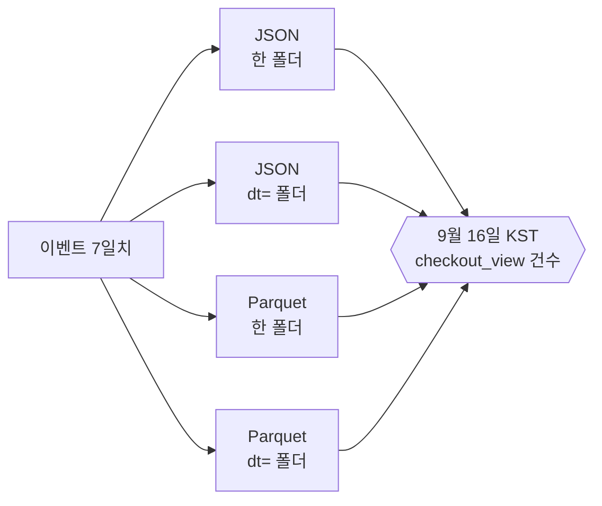
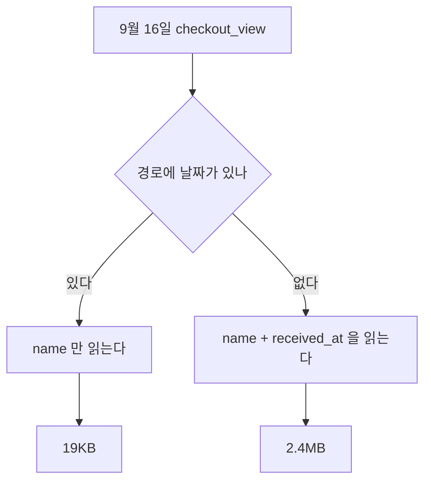

[3편](/posts/2026-09-17-analytics-decision/)에서 원본은 S3에 쌓고,
그 뒤는 누가 무엇을 묻느냐에 따라 넷으로 갈린다는 데까지 정했다.

이제 실제로 만들어볼 차례다. 첫 칸부터 시작했다.

## 어디서 만들었나

회사 것으로 실험할 수는 없다. 그래서 같은 모양을 로컬에 세웠다.

| 이 자리에 | 놓은 것 | 왜 바꿔도 되나 |
|---|---|---|
| S3 | MinIO | API가 같다. 엔드포인트만 바꾸면 그대로 옮겨간다 |
| Athena | DuckDB | 둘 다 파일을 옮기지 않고 그 자리에서 읽는다 |
| Firehose | 직접 쓴 적재 코드 | 버퍼 크기와 파일 개수를 내가 정할 수 있어야 했다 |

**AWS에서 돌린 게 아니다.** 요금이나 지연 시간은 이 글에서 못 다룬다.
대신 이 실험이 재려는 건 그게 아니라 **레이아웃에 따라 읽는 양이 얼마나 달라지는가**다.
그건 엔진이 바뀌어도 거의 그대로 간다. 파일을 어떻게 놓았느냐의 문제라서 그렇다.

코드는 [backend-lab의 event-storage-layout](https://xo0449.github.io/backend-lab/modules/event-storage-layout/)에 있다.
직접 돌려볼 수 있게 해뒀다.

## "쌓는다"가 한 문장이 아니었다

3편에서는 한 줄로 썼다. "S3에 Parquet으로, KST 날짜로 쌓는다."

막상 코드를 쓰려니 정할 게 넷이었다.

- 들어오는 대로 JSON 한 줄씩 쓸 것인가
- 폴더를 날짜로 자를 것인가
- 자른다면 어느 시간대로
- 몇 분 모아서 파일 하나로 쓸 것인가

넷 다 "일단 쌓아두고 나중에 정해도 되는 것"처럼 보였다.
그래서 들어오는 대로 한 폴더에 넣고 넘어가려다가 걸렸다.

이미 쌓인 걸 다시 쓰려면 전부 읽어서 다시 써야 한다.
한 번 쌓기 시작하면 그날부터 되돌리는 값이 붙는다.
얼마나 붙는지를 모르니 미룰지 말지도 못 정했다.

그래서 네 가지로 전부 쌓아놓고 같은 질문을 던져봤다.

## 답은 같고 읽는 양은 4,800배 달랐다

7일치 이벤트를 네 가지 모양으로 같은 저장소에 쌓았다.
내용도 파일 개수도 같다. 다른 건 형식과 경로뿐이다.

하루 5만 건씩 7일, 총 35만 건이다.

| 쌓은 모양 | 답 | 걸린 시간 | 읽은 양 |
|---|---|---|---|
| JSON · 한 폴더 | 7,097건 | 79ms | 92.0MB |
| JSON · 날짜 폴더 | 7,097건 | 63ms | 13.1MB |
| Parquet · 한 폴더 | 7,097건 | 3ms | 2.4MB |
| Parquet · 날짜 폴더 | 7,097건 | 1ms | 19KB |

답은 넷 다 같다. 읽은 양은 4,800배 차이가 난다.

읽은 양을 어떻게 셌는지도 적어둔다. 엔진이 알려주지 않아서 파일에서 되짚었다.
줄 단위 파일은 통째로 읽으니 객체 크기의 합이다.
열 단위 파일은 쓰는 컬럼의 청크만 읽으니 그 합이다.
Athena가 청구하는 기준이 이것과 같다.

데이터 양을 네 배로 늘려도 비율은 그대로였다.
**차이가 데이터 양이 아니라 모양에서 오기 때문이다.**

## 둘이 따로 논다는 걸 숫자 보고 알았다

"파티션을 나누면 빠르다"는 말은 알고 있었다.
그게 하나가 아니라 둘이라는 건 표를 보고 알았다.

**날짜 폴더는 읽을 파일을 줄인다.** 7일 중 하루만 보면 1/7이다.
92.0MB가 13.1MB가 됐다. 예상한 만큼이다.

**열 단위 형식은 읽을 컬럼을 줄인다.** 이쪽이 더 컸다.
건수를 세는 데 필요한 건 `name` 하나인데,
줄 단위 파일은 유입 경로도 세션 아이디도 같이 읽는다.
한 줄을 읽으려면 그 줄 전체를 읽어야 하니 어쩔 수 없다.

그리고 예상하지 못한 게 하나 더 있었다.

**날짜가 경로에 있으면 시각 컬럼을 아예 안 읽는다.**

경로에 날짜가 없으면 파일 안의 수신 시각을 읽어서 걸러야 한다.
컬럼이 하나 더 필요해진다.
파티션이 파일 수만 줄이는 게 아니었다.

## 파일을 잘게 쪼개면 무엇을 치르나

같은 하루치를 파일 개수만 바꿔 쌓아봤다. 내용은 같다.

| 파일 수 | 답 | 걸린 시간 | 차지하는 양 |
|---|---|---|---|
| 1개 | 7,097건 | 1ms | 1.7MB |
| 24개 | 7,097건 | 3ms | 1.8MB |
| 240개 | 7,097건 | 20ms | 2.4MB |
| 1,440개 | 7,097건 | 122ms | 5.1MB |

시간이 122배가 됐다. 읽는 데이터는 같은데 여는 횟수가 1,440배다.

차지하는 양도 3배가 됐다.
열 단위 파일은 파일마다 스키마와 통계를 따로 들고 있어서,
파일이 작아질수록 그 몫의 비중이 커진다.

1,440개는 억지로 만든 숫자가 아니다.
전송 서비스 버퍼를 1분으로 잡으면 하루에 그만큼 생긴다.
**"빨리 보이게 하려고" 버퍼를 줄인 값이 여기서 나온다.**

## 제일 무서운 건 마지막이었다

여기까지는 속도와 비용 이야기다. 느리면 느린 대로 답은 나온다.

마지막 실험은 달랐다.

어느 날 필드 이름이 바뀌었다고 하자.
체류 시간을 담던 `duration_ms`가 `dwell_ms`가 됐다.
흔한 일이다. 이름이 애매하니 고치자는 말은 어느 팀에나 나온다.

과거 파일과 같이 읽으면 어떻게 되는가.

| 어떻게 읽었나 | 결과 |
|---|---|
| 그냥 읽음 | **멈춘다.** 파일마다 컬럼이 다르다고 거부한다 |
| 이름으로 맞춰서 읽음 | 100,000건을 읽는데 평균은 50,000건으로만 계산된다 |

첫 줄은 괜찮다. 시끄럽게 실패하니까 고치게 된다.

**두 번째가 무섭다. 에러가 안 난다.**

읽은 행 수는 100,000건으로 멀쩡하다.
평균도 15,047이라는 그럴듯한 숫자가 나온다. 진짜 값은 15,003이다.
차이가 작아서 눈으로는 못 잡는다.

절반은 값이 비어 있어서 평균 계산에서 조용히 빠졌다.
그런데 어디에도 그 말이 안 나온다.

그리고 여기서 한 번 더 뒤집혔다.
타입이 바뀐 경우는 정반대였다.

| 어떻게 읽었나 | 결과 |
|---|---|
| 그냥 읽음 | 읽힌다. 합계도 진짜 값과 같았다 |
| 이름으로 맞춰서 읽음 | **멈춘다.** 문자열은 더할 수 없다고 한다 |

고치려고 켠 옵션이 어떤 경우엔 조용한 오답을 만들고,
어떤 경우엔 되던 것을 깨뜨린다.

그래서 이건 읽는 쪽에서 고를 문제가 아니었다.
**쌓는 쪽에 이름을 안 바꾸는 규칙이 있어야 한다.**
바꿔야 하면 새 컬럼을 추가하고, 옛 컬럼을 한동안 같이 채우고,
아무도 안 읽는 걸 확인한 다음에 뗀다.

3편 "정하지 않은 것"에 이렇게 적었었다.
"필드가 붙는 건 따라오는데, 이름이 바뀌거나 의미가 바뀌면 과거와 안 맞는다."
안 맞는 정도가 아니라 **안 맞는 줄도 모른다**는 게 이번에 나온 것이다.

## 그래서 정한 것

| 정한 것 | 왜 |
|---|---|
| 원본은 JSON 그대로 두고 정제본을 따로 쓴다 | 변환이 잘못됐을 때 되돌릴 게 있어야 한다 |
| 정제본은 Parquet, `dt=` 날짜 폴더 | 파일도 줄고 컬럼도 준다. 둘이 따로 논다 |
| 폴더 이름에 시간대를 적는다 | `dt=2026-09-16`만 보면 KST인지 UTC인지 모른다 |
| 하루 지난 파티션은 하루 한 번 합친다 | 나중에 넣으면 이미 쌓인 것부터 합쳐야 한다 |
| 필드 이름은 안 바꾼다. 추가만 한다 | 바꾸면 조용히 틀린 답이 나온다 |

앞의 넷은 되돌릴 수 있다. 마지막 하나는 규칙이라 사람이 지켜야 한다.
그래서 이건 코드가 아니라 문서로 남겨야 할 것 같다.

## AWS에서는 이 자리에 무엇이 오나

| 이 실험 | AWS | 주의할 점 |
|---|---|---|
| MinIO | Amazon S3 | |
| 적재 코드 | Amazon Data Firehose | 버퍼 크기가 곧 파일 개수다 |
| 형식 변환 | Firehose 레코드 포맷 변환 | Glue에 스키마가 먼저 있어야 돈다 |
| `dt=` 폴더 | Firehose Dynamic Partitioning | **기본값은 UTC다** |
| 테이블 정의 | AWS Glue Data Catalog | Athena·Redshift·EMR이 같은 걸 본다 |
| DuckDB | Amazon Athena | |
| 읽은 양 | Athena가 청구하는 스캔량 | |

Firehose가 기본으로 만드는 폴더는 UTC 기준이다.
아무것도 안 하면 UTC로 잘린다. KST로 자르려면
Dynamic Partitioning으로 레코드에서 날짜 키를 직접 뽑아 써야 한다.

이걸 놓치면 "9월 16일 매출"이 폴더 두 개에 걸치고,
아침에 나온 숫자와 사람이 말하는 하루가 아홉 시간 어긋난다.

## 안 해본 것

**압축 방식.** 기본값으로만 썼다.
Snappy와 Zstd 사이에서 읽는 속도와 크기가 갈린다는데 재보지 않았다.

**파일 안에서 정렬하기.** 같은 파일 안에서 이벤트 이름으로 정렬해두면
안 맞는 덩어리를 통째로 건너뛸 수 있다고 한다. 그 값은 따로 재야 한다.

**여럿이 같이 읽을 때.** 이번엔 질문 하나를 혼자 던졌다.
밤에 도는 배치와 낮에 오는 조회가 같이 돌면 어떻게 되는지는 안 봤다.
3편에서 나눈 경우 넷이 그거라, 그건 나중 편에서 볼 생각이다.

## 다음

쌓는 건 됐다. 다음은 3편의 **경우 둘**이다.
적재하지 않고 그 자리에서 조회하는 것.

거기서 재볼 게 이미 정해졌다.
파티션이 안 걸리는 쿼리를 던지면 얼마나 더 읽는가.
"어제"라고 쓰는 대신 "최근 24시간"이라고 쓰면 어떻게 되는가.

이번 편에서 가장 값진 건 4,800배가 아니었다.
**에러 없이 반쪽짜리 답이 나오는 경로가 있다**는 걸 본 것이다.
느린 건 언젠가 알게 된다. 틀린 건 아무도 말해주지 않는다.
