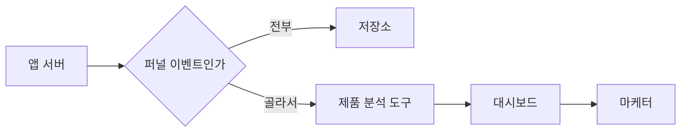

> **이 편이 만드는 칸** — 수집·적재 → 조회 창구 → **제품 분석 도구** → 운영 DB 결합 → 자원 분리

[5편](/posts/2026-09-18-query-without-loading/)까지 오면서 SQL 쓰는 사람이 물을 창구는 만들었다.

이번은 3편의 **경우 하나**다.
매일 같은 숫자를, SQL을 안 쓰는 사람이 보는 경우.

여기는 조회 엔진을 붙일 일이 아니다.
질문이 정해져 있으면 계산이 어려운 게 아니라 꺼내 보여주는 게 없는 것이다.
그래서 제품 분석 도구를 붙인다.

그런데 도구에만 보내면 원본이 우리 쪽에 안 남는다.
**같은 이벤트를 양쪽으로 보내야 한다.**

그리고 1편 "아직 잘 모르겠는 것"에 이렇게 적어뒀었다.

> 적재 경로가 둘이면 고장도 둘이라는 것.
> 한쪽만 끊겼을 때 알아채는 방법을 아직 못 찾았다.

이번 편이 그 숙제다.
[코드는 여기 있다.](https://xo0449.github.io/backend-lab/modules/dual-write-reconcile/)

## Mixpanel에 2만 건을 다 보낼 것인가, 1만 1천 건만 보낼 것인가

저장소에는 전부 보낸다. 나중에 무엇을 물을지 모르기 때문이다.
도구에는 골라 보낸다. 이벤트 수로 돈을 받기 때문이다.

하루 2만 건 기준으로 이렇게 나왔다.

| | 건수 |
|---|---|
| 하루에 만들어진 이벤트 | 20,000건 |
| 그중 퍼널에 쓰는 것 | 11,546건 |
| 전부 보내면 도구가 세는 수 | 20,000건 |
| 골라 보내면 | 11,546건 (42% 적음) |

골라 보내는 게 아끼자는 이야기만은 아니다.
화면 스크롤이나 서버 내부 로그가 퍼널 화면에 섞이면 보기도 나빠진다.
안 보낸 것도 저장소에는 그대로 남아 있어서 나중에 물을 수 있다.

## Mixpanel 쪽만 30분 끊어봤다

| | 결과 |
|---|---|
| 저장소에 들어간 것 | 20,000건 (전부) |
| 도구에 들어간 것 | 11,291건 |
| 도구가 받았어야 할 것 | 11,546건 |
| 끊긴 동안 흘린 것 | 255건 |

여기가 이 편의 요점이다.

**저장소는 멀쩡하다. 도구 화면에도 숫자가 나온다.**

어제보다 2.2% 적은 숫자다. 그 정도는 그냥 그런 날이다.
주말이었나 보다, 광고를 안 돌렸나 보다 하고 넘어간다.

에러 알림도 안 온다. 도구는 요청을 거절했을 뿐이고
우리 쪽 서버는 그걸 삼키고 계속 돌았다.

그리고 삼킨 게 잘못이 아니다.
**도구가 죽었다고 저장소 적재까지 멈추면 그게 더 나쁘다.**
그건 실제로 확인했다. 실패를 던지게 고쳐서 돌려보니 원본이 빈다.
원본이 비는 건 도구 숫자가 2% 낮은 것과 비교가 안 되는 손해다.

5분만 끊으면 0.4% 모자란다. 그건 정말 아무도 못 알아챈다.

## S3 건수와 Mixpanel 건수를 맞춰보면 255건이 나온다

저장소를 기준으로 삼는다. 전부 들어가 있는 쪽이 그쪽이기 때문이다.

| 이벤트 | 저장소 | 도구 | 차이 |
|---|---|---|---|
| cart_add | 2,877 | 2,819 | 58 |
| checkout_view | 2,829 | 2,771 | 58 |
| item_view | 2,952 | 2,877 | 75 |
| purchase | 2,888 | 2,824 | 64 |

합계 255건. 끊긴 동안 흘린 수와 정확히 같다.

이건 대단한 장치가 아니다. 쿼리 한 줄과 도구 API 한 번이다.
그런데 **이게 없으면 영원히 모른다.**

1편에서 "알아채는 방법을 못 찾았다"고 썼던 게 좀 민망했다.
찾기 어려운 게 아니라 그냥 세어보면 되는 거였다.
어려운 건 만드는 게 아니라 **만들어야 한다는 걸 아는 것**이었다.

## 7일에 한 번 대조하면 1,785건을 흘린 뒤에 안다

| 주기 | 최악의 경우 알아채기까지 | 그동안 흘릴 수 있는 양 |
|---|---|---|
| 1일에 한 번 | 1일 | 255건 |
| 7일에 한 번 | 7일 | 1,785건 |
| 30일에 한 번 | 30일 | 7,650건 |

이 표에서 진짜 중요한 건 건수가 아니다.
**그 사이에 누군가 그 숫자로 판단을 내린다는 것**이다.

7일 동안 2% 낮은 전환율을 보고 "이번 배너는 별로였다"고 결론 내린 다음,
대조를 돌려서 도구가 끊겼던 걸 알게 되면 그 결론을 되돌릴 수 있는가.

숫자는 고칠 수 있다. 이미 내린 판단은 못 고친다.

4편에서 "느린 건 언젠가 알게 된다. 틀린 건 아무도 말해주지 않는다"고 썼는데,
이건 한 발 더 나간 경우다. 틀린 줄 알았을 때는 이미 늦었다.

## insert_id 없이 다시 보내면 1,137건이 2,274건이 된다

대조로 255건이 빠진 걸 알았다고 하자. 어디까지 들어갔는지는 모른다.
그러면 그날 것을 통째로 다시 보내게 된다.

| 다시 보내는 방법 | 처음 | 다시 보낸 뒤 |
|---|---|---|
| 그냥 보냄 | 1,137건 | 2,274건 (두 배) |
| 멱등 열쇠를 같이 보냄 | 1,137건 | 1,137건 (그대로) |

열쇠가 없으면 재전송이 그대로 중복이 된다.
**그러면 빠진 걸 알아도 다시 보낼 수가 없다.**

고칠 방법이 없는 문제를 발견하는 장치만 만들어두면 소용이 없다.
대조 장치와 멱등 열쇠는 같이 있어야 한다. 하나만 있으면 둘 다 값이 없다.

이걸 나중에 붙이는 건 어렵다.
열쇠 없이 몇 달 보내놓고 나서 붙이면, 그 전에 보낸 것과는 못 맞춘다.
**처음에 한 줄 더 쓰는 것과 나중에 못 고치는 것의 차이다.**

## 그래서 정한 것

| 정한 것 | 왜 |
|---|---|
| 도구에는 퍼널 이벤트만 보낸다 | 이벤트 수로 돈을 받는다. 나머지는 저장소에 남는다 |
| 도구가 죽어도 저장소 적재는 계속한다 | 원본이 비는 게 훨씬 비싼 손해다 |
| 보낼 때 멱등 열쇠를 같이 보낸다 | 없으면 재전송이 중복이 된다 |
| 하루 한 번 양쪽 건수를 맞춘다 | 안 돌리면 영원히 모른다 |
| 대조는 저장소를 기준으로 한다 | 전부 들어가 있는 쪽이 그쪽이다 |
| 허용 오차를 정해둔다 | 안 정하면 매일 울리고, 그러면 아무도 안 본다 |

마지막 줄은 아직 못 정했다.
자정 경계에 걸친 것도 있고 도구가 자기 기준으로 거르는 것도 있어서
양쪽이 정확히 같을 수는 없다. 몇 건까지가 정상인지는 세어봐야 알겠다.

## AWS에서는

| 이 실험 | 실제 |
|---|---|
| 저장소 | Amazon S3 + Amazon Data Firehose |
| 제품 분석 도구 | Mixpanel, Amplitude, GA4 |
| 멱등 열쇠 | Mixpanel의 `$insert_id`, Amplitude의 `insert_id` |
| 대조 쿼리 | Amazon Athena |
| 대조 스케줄 | EventBridge Scheduler |
| 차이 알림 | CloudWatch 지표 + 알람 |

제품 분석 도구는 대체로 중복을 거르는 열쇠를 받는다.
다만 보통 며칠 안에 들어온 같은 열쇠까지만 본다.
한 달 지난 걸 다시 보내면 그때는 중복으로 들어간다.

그래서 대조 주기를 그 기간 안으로 잡아야 한다.
30일에 한 번 대조하면 알아낸 시점에 이미 고칠 수 없다.
**주기를 정하는 기준이 "얼마나 자주 볼 수 있나"가 아니라 "언제까지 고칠 수 있나"였다.**

## Mixpanel이 세는 기준이 우리와 다를 때는 못 잡는다

**도구가 세는 기준이 우리와 다를 때.**
같은 이벤트를 보냈는데 도구가 세션을 다르게 묶으면 숫자가 또 갈린다.
그건 대조로 못 잡는다. 건수는 맞는데 화면의 수치가 다를 것이다.

**재전송을 자동으로 하는 것.**
지금은 빠진 걸 알아내는 데까지다.
자동으로 다시 보내려면 어디부터 보낼지를 알아야 하는데, 그건 아직 모르겠다.

## 다음

다음은 3편의 **경우 셋**이다.
이벤트만으로는 답이 안 나오는 질문.

"결제 화면 본 사람들 매출이 얼마야"를 물으면
화면을 봤다는 사실은 저장소에 있고 결제는 운영 DB에 있다.
둘을 붙여야 하는데, 가져오는 방법이 여럿이라고만 알고 있다.
