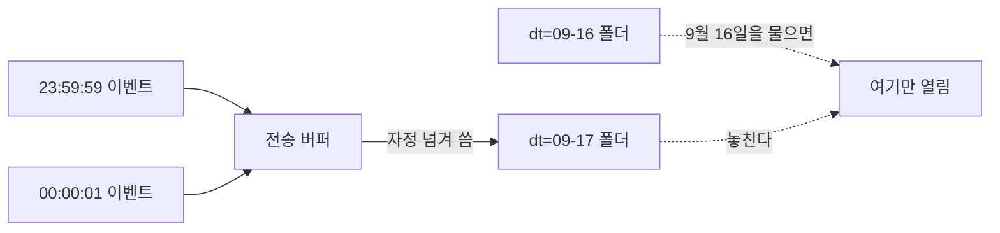

[4편](/posts/2026-09-17-storage-layout/)에서 쌓는 모양을 정했다.
날짜 폴더, 열 단위 형식, KST로 자른 파티션.

이제 분석가에게 조회 창구를 열어주면 된다.
웨어하우스는 아직 안 들인다. 3편에서 정한 대로 **적재하지 않고 그 자리에서 읽는다.**

잘 쌓아뒀으니 알아서 싸게 읽히겠거니 했다.

## 창구를 열고 나면 쿼리는 내가 안 쓴다

이게 먼저 걸렸다.

쌓는 모양은 내가 정했다. 읽는 방법은 남이 정한다.
분석가가 어떻게 물을지 나는 모른다.

4편에서 파티션을 나눠서 92MB가 19KB가 됐는데,
그건 내가 `dt`로 거르는 쿼리를 썼기 때문이다.
다른 방식으로 물으면 어떻게 되는지는 안 봤다.

그래서 같은 질문을 일곱 가지 방법으로 던져봤다.
질문은 하나다. "2026년 9월 16일 KST 하루에 이벤트가 몇 건인가."

[코드는 여기 있다.](https://xo0449.github.io/backend-lab/modules/query-without-loading/)

## 답이 세 가지로 갈렸다

| 어떻게 물었나 | 답 | 연 파일 |
|---|---|---|
| 경로의 날짜로 콕 집어 | 50,000건 | 1개 |
| 경로의 날짜를 범위로 | 50,000건 | 1개 |
| 경로의 날짜를 함수로 감싸 | 50,000건 | 1개 |
| 파일 안의 시각으로 | 50,001건 | **7개** |
| 시각을 날짜로 바꿔서 | 50,001건 | **7개** |
| 하루만 열고 시각으로 마무리 | 49,999건 | 1개 |
| 앞뒤로 하루씩 열고 마무리 | 50,001건 | 3개 |

두 가지가 한꺼번에 나왔다.

**여는 파일 수가 갈렸다.** 이건 예상한 것이다.
경로에 있는 날짜로 거르면 하루치만 연다.
파일 안의 시각으로 거르면 열어보기 전에는 알 수 없으니 전부 연다.

3편에서 "최근 24시간이라고 쓰면 어떻게 되는가"를 다음 편 숙제로 적어뒀는데,
답은 이거다. 7일치를 전부 읽는다.

**답도 갈렸다.** 이건 예상하지 못했다.

## 셋 다 틀린 게 아니었다

이유를 찾아보니 이렇게 나왔다.

```
2026-09-15 폴더에 들어있는 KST 2026-09-16 이벤트  2건
2026-09-16 폴더에 들어있는 KST 2026-09-17 이벤트  1건
```

파티션은 파일이 만들어진 시점으로 갈린다.
자정 직전에 들어온 이벤트가 자정 직후 파일에 실린다.



그러면 셋 중 무엇이 맞는가. **질문이 정한다.**

| 세고 있는 것 | 맞는 경우 |
|---|---|
| 50,000 · 경로만 | "어제 파일에 뭐가 들어왔나". 적재를 점검할 때 |
| 50,001 · 시각만 | "9월 16일에 실제로 일어난 일". 지표를 낼 때 |
| 49,999 · 경로로 좁히고 시각으로 | 둘 다 아니다 |

세 번째가 함정이다.
경로로도 거르고 시각으로도 걸렀으니 제일 꼼꼼해 보이는데, 실제로는 빠뜨린다.
파일을 하루치만 열었으니 옆 폴더에 있는 2건은 애초에 후보에 없다.

그래서 **앞뒤로 하루씩 넓게 열고, 시각으로 정확히 거른다.**
파일은 3개만 열고 답은 정확하다. 7개를 다 열 필요가 없다.

이건 4편에서 정한 "폴더 이름에 시간대를 적는다"가 왜 필요한지와 같은 이야기다.
`dt=2026-09-16`이 무엇을 담고 있는지를 모르면 이 셋 중에 뭘 물어야 할지도 모른다.

### 함수로 감싸면 프루닝이 깨진다던데

`strftime(dt, '%Y-%m-%d') = '2026-09-16'` 처럼 파티션 컬럼을 함수로 감싸봤다.
이 엔진은 풀어내서 파일 1개만 열었다.

**엔진마다 다르다.** 여기서 됐다고 어디서나 된다고 쓸 수 없다.
확실한 경계는 함수가 아니라 이쪽이었다.
**파티션 컬럼으로 거르면 걸러지고, 아니면 안 걸러진다.**

## 무엇을 꺼내느냐는 따로 논다

조건은 그대로 두고 SELECT만 바꿨다. 파일은 셋 다 1개다.

| 무엇을 꺼냈나 | 읽은 양 |
|---|---|
| `SELECT *` | 1.7MB |
| 세 컬럼만 | 317KB |
| 건수만 | 19KB |

같은 하루, 같은 파일 한 개인데 93배 차이가 난다.

분석가가 탐색할 때 `SELECT *`로 시작하는 건 자연스럽다.
무엇이 있는지부터 봐야 하니까.

그게 나쁘다는 게 아니라, **탐색과 정기 조회를 같은 자리에 두면 안 된다**는 뜻이다.
탐색은 어차피 넓게 읽는다. 정기 조회는 좁게 읽어야 한다.

## 같은 질문을 33번째부터는 미리 세어두는 게 싸다

"어제 결제 화면 조회수"를 매일 여러 번 묻는다고 하자.
원본을 매번 읽을 것인가, 하루 한 번 세어두고 그걸 읽을 것인가.

| | 한 번 물을 때 | 미리 치르는 값 |
|---|---|---|
| 원본을 매번 | 19KB | 없음 |
| 요약본을 만들어두고 | 491B | 590KB |

| 물어본 횟수 | 원본 누적 | 요약본 누적 | 싼 쪽 |
|---|---|---|---|
| 1번 | 19KB | 590KB | 원본 |
| 10번 | 187KB | 595KB | 원본 |
| 30번 | 561KB | 604KB | 원본 |
| **33번** | 617KB | 606KB | **요약본** |

33번째부터 뒤집힌다.

여기서 요약본은 웨어하우스가 아니다.
같은 저장소에 작은 파일 하나를 더 쓴 것뿐이다.
3편에서 "자주 보는 것만 안으로 넣는다"라고 적었던 것의 제일 싼 형태다.

그리고 33이라는 숫자 자체는 우리 데이터 기준이다.
**중요한 건 이게 세어봐야 정해진다는 것이다.**
하루 세 번 묻는데 요약본을 만들면 그건 손해다.

## 그래서 정한 것

| 정한 것 | 왜 |
|---|---|
| 창구를 열 때 예시 쿼리를 같이 준다 | "날짜는 `dt`로 거르세요" 한 줄에 7개가 1개가 된다 |
| 앞뒤 하루를 여는 조건은 뷰로 감싼다 | 매번 쓰게 하면 아무도 안 쓴다 |
| 탐색용과 정기 조회용을 나눈다 | `SELECT *`는 탐색에서만 |
| 질문이 들어오는 횟수를 센다 | 요약본을 만들 시점은 그걸로 정해진다 |

첫 줄이 이 편에서 제일 값싸고 효과가 큰 것이었다.
엔진이 대신 해주지 않는다. 문서 한 줄이 파일 여섯 개를 안 연다.

## AWS에서는

| 이 실험 | AWS |
|---|---|
| MinIO | Amazon S3 |
| DuckDB | Amazon Athena |
| `read_parquet` 의 경로 | Glue Data Catalog 의 테이블 |
| `EXPLAIN ANALYZE` 의 파일 수 | Athena 콘솔의 스캔량 |
| 요약본 파일 | Athena CTAS 결과 테이블 |
| 뷰로 감싸기 | Glue 카탈로그의 VIEW |
| 실수로 전체를 훑는 쿼리 막기 | Workgroup 의 쿼리별 스캔 한도 |

파일 수는 엔진에게 직접 물었다. `EXPLAIN ANALYZE`가 `Files Read`를 알려준다.
4편처럼 파일 크기에서 되짚기만 하면 "이만큼 읽었을 것이다"까지만 말할 수 있다.
프루닝이 실제로 걸렸는지는 엔진만 안다.

## 작게 확인하면 이 문제를 못 본다

하나 더 적어둔다.

데이터를 하루 5,000건으로 줄이고 같은 실험을 돌리면
답이 일곱 가지 방법에서 전부 똑같이 나온다.

자정 3초 전에 들어온 이벤트가 있어야 생기는 일이기 때문이다.
작게 쌓아놓고 확인하면 경계 문제를 못 본다.

그래서 **규모를 키워봐야 보이는 것이 따로 있다**는 걸 이번에 알았다.
로컬에서 몇백 건으로 확인하고 넘어갔으면 이 편은 안 나왔다.

## 다음

읽는 쪽은 됐다. 다음은 3편의 **경우 하나**다.
SQL을 안 쓰는 사람에게 보여주는 것.

이벤트를 저장소와 제품 분석 도구 양쪽으로 보내야 하는데,
1편 "아직 잘 모르겠는 것"에 이렇게 적어뒀다.

> 적재 경로가 둘이면 고장도 둘이라는 것.
> 한쪽만 끊겼을 때 알아채는 방법을 아직 못 찾았다.

이번엔 그걸 찾아볼 차례다.
