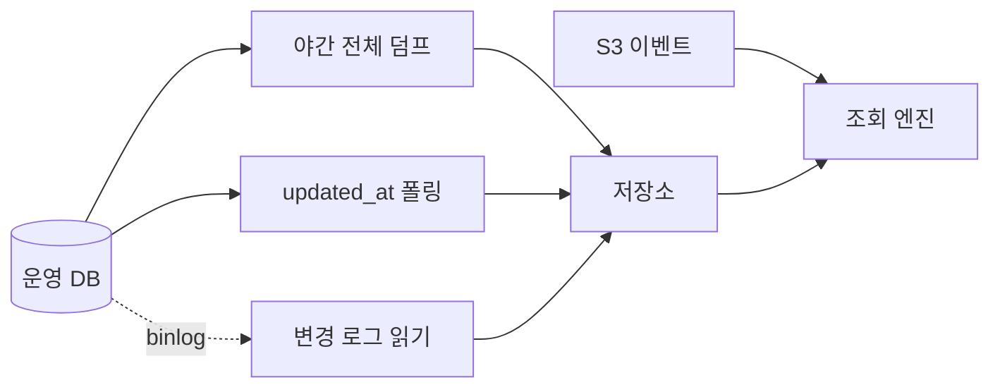

[6편](/posts/2026-09-18-dual-write/)까지 오면서 저장소도, 조회 창구도, 대시보드도 만들었다.

그런데 답이 안 나오는 질문이 남아 있다. 3편의 **경우 셋**이다.

"어제 결제 화면 본 사람들 매출이 얼마야."

화면을 봤다는 사실은 저장소에 있다. 그 결제가 아직 살아있는지는 운영 DB에 있다.
둘을 붙여야 답이 나온다.

[코드는 여기 있다.](https://xo0449.github.io/backend-lab/modules/order-join-freshness/)

## 먼저 밝히고 시작한다

3편에서 운영 DB에 직접 조인하지 않는 이유를 이렇게 썼다.

> 한 번 크게 도는 집계가 주문 조회를 몇 초씩 밀어내는 걸 본 적이 있다.

이번 편에서 그걸 숫자로 보여주려고 했다. **못 했다.**

먼저 잘 된 것부터 적고, 실패한 쪽은 뒤에 따로 적는다.

## 가져오는 방법이 셋이었다

셋을 같은 순간에 돌리고, 그 사이에 세 가지 일이 일어나게 했다.
취소 12,000건, 한 주문이 두 번 바뀜, 한 주문이 지워짐.

| 방법 | 가져온 행 | 지워진 걸 아나 | 중간 상태를 보나 |
|---|---|---|---|
| 야간 전체 덤프 | 119,999 | 없어진 걸로 앎 | 못 봄 |
| `updated_at` 폴링 | 12,001 | **모름** | 못 봄 |
| 변경 로그 읽기 | 12,003 | 지웠다고 알려줌 | **다 봄** |

셋이 다 다른 걸 본다.

**전체 덤프**는 그 순간의 사진이다. 지워진 행은 그냥 없다.
없어진 건 알 수 있는데 언제 왜 없어졌는지는 모른다.

**`updated_at` 폴링**이 제일 의외였다.
바뀐 것만 가져오니 자주 돌릴 수 있고 만들기도 쉽다.
그런데 지워진 행은 `SELECT`에 안 걸린다. **영영 못 본다.**
지워진 주문이 분석 쪽에는 계속 살아있게 된다.

**변경 로그 읽기**는 7번 주문이 두 번 나온다.
`PAID → CANCELED → PAID`를 다 본다. 폴링은 마지막 모습만 가져온다.

폴링은 결과를 보고, 변경 로그는 과정을 본다.
"만들기 쉬운 쪽"이 폴링이라고 생각했는데,
못 보는 것이 무엇인지를 알고 나니 쉬운 게 아니었다.

## 어제 밤 스냅샷으로 답하면 14.5% 높다

어제 자정에 전체 덤프를 찍었다. 그때는 전부 살아있는 결제였다.
새벽에 취소 50,000건이 들어왔다.
오늘 아침에 "어제 결제 화면 본 사람들 매출"을 물었다.

| 무엇으로 답했나 | 본 사람 | 살아있는 주문 | 금액 |
|---|---|---|---|
| 어제 밤 스냅샷만 | 5,968 | 119,045 | 1,202,631만원 |
| 스냅샷 + 변경 로그 | 5,968 | 104,026 | 1,050,638만원 |
| 운영 DB에 직접 (진짜 값) | 5,968 | 104,026 | 1,050,638만원 |

**15억원, 14.5% 높게 나온다.**

여기서 중요한 건 이게 **틀린 값이 아니라는 것**이다.
어제 자정에는 실제로 저 금액이었다. 스냅샷은 제 일을 했다.

틀린 건 그걸 오늘 아침 회의에 가져간 쪽이다.
그런데 화면에는 그냥 숫자가 떠 있고, 언제 기준인지는 안 적혀 있다.

변경 로그를 얹은 쪽은 운영 DB와 **정확히 같은 답**을 냈다.
104,026건, 1,050,638만원. 이게 맞는지 확인하려고 테스트로 박아뒀다.

### 지표를 잘못 고르면 이게 안 보인다

처음에는 "본 사람 중 산 사람 비율"로 쟀다. 99.77%가 나왔다.
취소를 반영해도 99.46%였다. **0.3%p 차이다.**

사람 수는 잘 안 움직인다.
주문 하나가 취소돼도 그 사람이 다른 주문을 갖고 있으면 여전히 "산 사람"이다.

금액으로 바꾸니 14.5%가 됐다.

같은 데이터, 같은 문제인데 지표를 어떻게 잡느냐에 따라
보이기도 하고 안 보이기도 한다.
**0.3%p를 보고 "괜찮네"하고 넘어갈 뻔했다.**

## 재현하지 못한 것

여기서부터가 실패한 쪽이다.

"운영 DB에 직접 조인하면 서비스가 밀린다"를 보여주려고
5초 걸리는 재구매 분석 쿼리를 만들고, 그게 도는 동안 주문 조회 지연을 쟀다.

| | 집계 시간 | 주문 조회 p50 | p95 |
|---|---|---|---|
| 아무것도 안 돌릴 때 | 4,000ms | 1.4ms | 2.8ms |
| 재구매 분석을 운영 DB에서 | 5,057ms | 0.6ms | 1.0ms |
| 같은 걸 4개 동시에 | 6,033ms | 0.6ms | 1.6ms |
| 같은 걸 저장소에서 | 341ms | 6.0ms | 9.0ms |

**안 밀렸다.** 오히려 더 빨랐는데 그건 측정 노이즈다.

마지막 줄이 제일 느린 건 더 웃긴다.
같은 노트북에서 조회 엔진이 CPU를 쓰니까 측정하는 쪽이 느려진 것이다.
실제로는 저기가 다른 기계다. 이건 재는 방법의 한계다.

주문 40만 행에 조회 하나가 도는 정도로는 이 DB가 흔들리지 않는다.
100만으로 올려도 마찬가지였다.

그러면 내가 3편에 쓴 건 뭐였나.
실제로 겪은 건 맞는데, 그때 아팠던 게 **이것 때문이 아니었을 수 있다.**
안 재본 것들이 있다.

- 실제 테이블은 40만이 아니라 훨씬 컸다
- 여기서는 읽기만 했다. 실제로는 같은 순간에 쓰기가 계속 들어온다
- 커넥션 풀이 서비스와 공유였고 한도가 훨씬 낮았다

셋 다 재보지 않았으니 지금은 짐작이다.
**"본 적 있다"와 "이것 때문이다"는 다른 말이었다.**

## 그래도 가져오기로 한 이유

부하가 재현 안 됐다고 결정이 바뀌지는 않았다.
다만 **이유가 바뀌었다.** 그리고 바뀐 이유가 더 나은 것 같다.

| 이유 | |
|---|---|
| 이벤트와 주문을 한 엔진에서 조인해야 한다 | 나눠 있으면 한쪽 목록을 통째로 넘겨야 한다. 사용자 6,000명이면 파라미터가 6,000개다 |
| 운영 DB 스키마가 바뀌면 분석 쿼리가 깨진다 | 가져오는 자리를 한 겹 두면 거기서 흡수한다 |
| 분석가에게 운영 DB 권한을 안 줘도 된다 | 이게 실제로는 제일 클 것 같다 |
| 과거를 볼 수 있다 | 운영 DB에는 지금 상태만 있다 |

마지막 줄이 이번에 새로 알게 된 것이다.
**운영 DB는 "지금"만 안다. 분석은 "그때"를 물어본다.**

지워진 주문은 운영 DB에서 조회할 방법이 없다.
변경 로그를 저장소에 쌓아두면 그건 남는다.
이건 부하와 아무 상관없는 이유고, 부하보다 확실하다.

## 그래서 정한 것

| 정한 것 | 왜 |
|---|---|
| 하루 한 번 전체 덤프로 시작한다 | 만들기 제일 쉽고 되돌리기도 쉽다 |
| 금액을 묻는 질문이 생기면 변경 로그를 얹는다 | 취소를 모르면 14.5% 틀린다 |
| `updated_at` 폴링은 안 쓴다 | 지워진 행을 영영 못 본다 |
| 화면에 "언제 기준"을 같이 띄운다 | 늦은 게 문제가 아니라 늦은 줄 모르는 게 문제다 |
| 읽기 전용 복제본에서 뜬다 | 부하를 재현 못 했어도 원본을 건드릴 이유는 없다 |

마지막 줄은 근거가 약해진 채로 유지한다.
재현은 못 했지만, 안 할 이유도 없는 선택이라서 그렇다.

## AWS에서는

| 이 실험 | AWS |
|---|---|
| MySQL | Amazon Aurora MySQL |
| 읽기 전용 복제본 | Aurora Replica |
| 야간 전체 덤프 | AWS DMS Full Load, S3 타깃 |
| `updated_at` 폴링 | AWS Glue JDBC 잡 |
| 변경 로그 읽기 | AWS DMS CDC 모드, 또는 Debezium on MSK |
| 조인 | Amazon Athena |
| 마지막 모습만 고르기 | Apache Iceberg 의 MERGE |

변경 로그를 계속 쌓으면 같은 주문이 수십 번 나온다.
지금은 조회할 때마다 마지막 것을 고르는데, 파일이 쌓이면 이게 무거워진다.
테이블에 반영해두려면 갱신을 지원하는 형식이 필요하고 그게 Iceberg다.
2편에서 들은 대로 작은 파일을 합치는 작업이 따라붙는다.

## 다음

마지막 경우가 남았다. 3편의 **경우 넷**.
밤에 도는 배치와 아침에 오는 조회가 서로 미는 것.

이번 편에서 운영 DB 경합은 재현 못 했는데,
분석 엔진 안에서의 경합은 어떨지 아직 모른다.
이번엔 재현이 될지 그것부터 봐야겠다.
