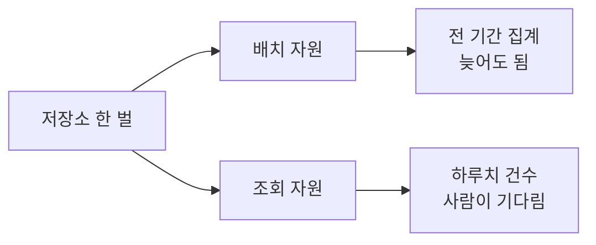
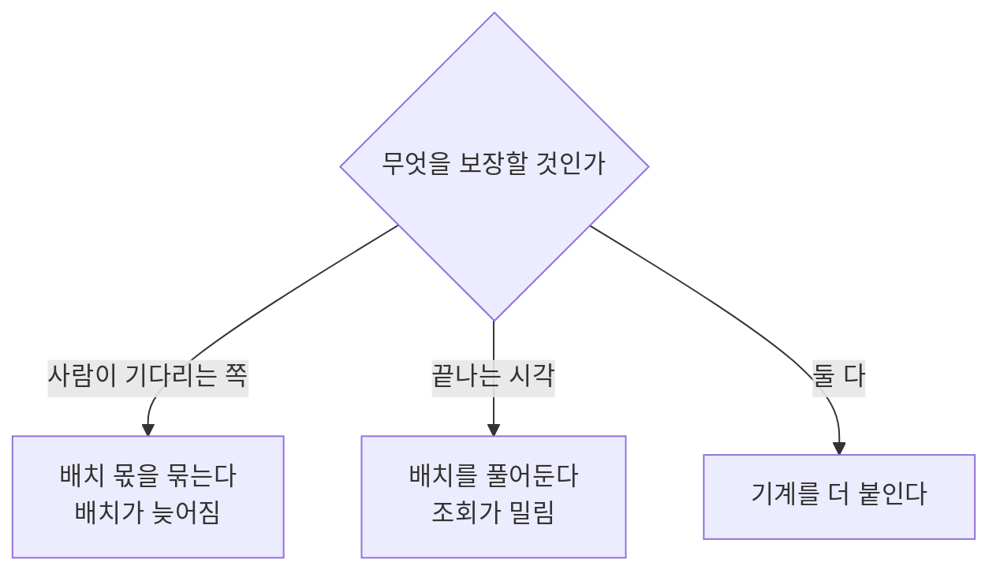

> **이 편이 만드는 칸** — 수집·적재 → 조회 창구 → 제품 분석 도구 → 운영 DB 결합 → **자원 분리**

3편에서 나눈 네 경우 중 마지막이다.

밤에 도는 집계가 있다. 전 기간을 훑고 사용자별로 묶는다.
몇 초 늦어도 아무도 안 본다. 끝나기만 하면 된다.

아침에 오는 조회가 있다. 하루치에서 건수를 센다.
사람이 화면 앞에서 기다린다. 늦으면 바로 안다.

둘이 같은 자원에서 돌면 서로 기다린다.
이 말은 여러 번 들었는데 얼마나 기다리는지는 몰랐다.

[7편](/posts/2026-09-19-order-join/)에서 운영 DB 경합은 재현에 실패했다.
이번엔 될지부터 봐야 했다.

[코드는 여기 있다.](https://xo0449.github.io/backend-lab/modules/workload-isolation/)

## 한 인스턴스에 배치와 조회를 두니 p95가 7ms에서 52ms

저장소는 하나로 두고 계산하는 쪽만 바꿔가며 쟀다.
배치를 계속 돌리면서 조회를 던지고 지연을 봤다.



| | 조회 p50 | 조회 p95 | 조회 횟수 | 배치 횟수 |
|---|---|---|---|---|
| 배치가 안 돌 때 | 6ms | 7ms | 539 | 0 |
| 한 자원에서 같이 | 39ms | **52ms** (7.3배) | 121 | 122 |
| 자원을 나눠서 | 7ms | 15ms (2.1배) | 380 | 135 |

**7.3배.** 같은 질문, 같은 파일인데 배치가 옆에서 돌고 있다는 것만으로 그렇다.

조회 횟수가 539회에서 121회로 준 것도 같이 봐야 한다.
같은 시간 동안 4분의 1밖에 못 물어봤다. 한 번에 오래 붙잡히기 때문이다.

7편에서 안 밀렸던 것과 대비된다.
운영 DB는 40만 행짜리 무거운 쿼리에도 안 흔들렸는데,
분석 엔진은 자기 안에서 바로 밀린다.

**차이는 하는 일의 모양이다.**
운영 DB의 주문 조회는 인덱스를 타고 스무 행을 꺼낸다. 남이 뭘 하든 상관이 적다.
분석 엔진은 둘 다 파일을 통째로 읽는다. 같은 자원을 정면으로 다툰다.

## 인스턴스를 나눠도 15ms까지만 내려간다. 기계가 하나라서

52ms가 15ms가 됐다. 그런데 7ms로 돌아가지는 않았다.

이유는 간단하다. **같은 기계다.**
계산 자원을 나눠도 CPU는 하나다.
배치가 코어를 다 쓰면 조회 쪽도 결국 기다린다.

그래서 배치가 쓸 수 있는 몫을 정해봤다.

| | 조회 p50 | 조회 p95 | 배치 횟수 |
|---|---|---|---|
| 배치가 안 돌 때 | 6ms | 8ms | 0 |
| 배치가 스레드를 다 씀 | 7ms | 17ms (2.2배) | 132 |
| 배치를 1스레드로 묶음 | 4ms | **5ms** (0.6배) | 38 |

조회가 기준보다 빨라졌다. 배치가 거의 방해를 안 하니 그렇다.

**그런데 배치가 3.5배 덜 돌았다.**

이게 이번 편에서 제일 중요한 줄이다.

## 배치를 1스레드로 묶으면 조회는 5ms, 배치는 3.5배 덜 돈다

자원을 나누는 건 공짜가 아니다. 한쪽을 보장하면 다른 쪽이 느려진다.
기계를 더 붙이지 않는 한 총량은 그대로다.



배치 몫을 4스레드로 풀어보니 이렇게 나왔다.

| 배치 몫 | 조회 p95 | 배치 횟수 |
|---|---|---|
| 제한 없음 | 17ms | 132회 |
| 4스레드 | 6ms | 95회 |
| 1스레드 | 5ms | 38회 |

4스레드가 균형이 낫다. 조회는 거의 안 밀리고 배치는 1.3배만 덜 돈다.
1스레드까지 조이면 조회가 1ms 더 빨라지는 대신 배치가 반토막 난다.

**이 값 하나로 저울의 무게가 정해진다.**
그래서 나누기 전에 정해야 할 건 어떻게 나누느냐가 아니라
**무엇을 보장할 것인가**였다.

## 자원을 둘로 나눠도 S3 파일은 7개 그대로였다

자원을 나눴는데 데이터가 갈라지면 의미가 없다. 확인했다.

```
자원 둘이 같은 답을 내나  예
각각 걸린 시간           39ms / 39ms
저장소에 있는 파일        7개 (46.6MB)
```

자원을 둘로 나눠도 파일은 그대로 7개다.
읽는 쪽이 늘었을 뿐 저장은 한 곳이다.

2편 컨퍼런스에서 들은 Single Copy 이야기가 이거였다.
그때는 "저장과 계산을 나눈다"가 말로만 이해됐는데,
복사본이 안 생기는 걸 파일 개수로 보니 그제야 뭘 지키는 이야기인지 알겠다.

복사해서 나누면 숫자가 갈라지고, 그다음엔 어느 쪽이 맞는지를 두고 회의를 한다.

## 그래서 정한 것

| 정한 것 | 왜 |
|---|---|
| 데이터는 복사하지 않는다 | 복사본이 생기면 맞는 숫자를 다투게 된다 |
| 배치와 조회는 다른 자원에서 돌린다 | 같이 두면 조회가 7배 밀린다 |
| 배치 쪽에 몫을 정해둔다 | 안 정하면 나눠도 2배는 밀린다 |
| 무엇을 보장할지 먼저 정한다 | 총량은 그대로다. 누가 기다릴지를 고르는 것이다 |
| **이 문제가 오기 전까지는 나누지 않는다** | 나누는 순간 운영할 게 둘이 된다 |

마지막 줄이 중요하다.

[5편](/posts/2026-09-18-query-without-loading/)에서처럼 쿼리마다 자원이 따로 뜨는 방식을 쓰고 있으면
이 문제 자체가 늦게 온다. 미리 나눌 이유가 없다.

3편에서 "경우 넷은 아직 안 왔다. 그런데 온다는 건 안다"고 썼는데,
지금도 여전히 안 왔다. 달라진 건 **왔을 때 뭘 할지를 안다**는 것이다.

## AWS에서는

| 이 실험 | AWS | Snowflake |
|---|---|---|
| 계산 자원 하나 | Athena Workgroup | Virtual Warehouse |
| 자원을 나누는 것 | 워크그룹을 `batch` / `adhoc` 으로 | 용도별 웨어하우스 |
| 몫을 정하는 것 | 워크그룹별 스캔 한도, Provisioned Capacity | 웨어하우스 크기 |
| 저장은 한 벌 | 같은 S3 · 같은 Glue 테이블 | 같은 저장 계층 |
| 기계를 더 붙이는 것 | Concurrency Scaling, Redshift Serverless | Multi-cluster warehouse |

Athena는 쿼리마다 자원이 따로 뜨는 편이라 이 문제가 늦게 온다.
거기서 막히는 건 계산 자원이 아니라 계정 단위 동시 실행 한도라,
워크그룹을 나누는 것만으로도 한동안 버틴다.

Snowflake의 웨어하우스 크기를 올리는 것과 여기서 스레드를 푸는 것이 같은 일이다.
다만 거기서는 기계를 더 붙이는 쪽이라 총량이 늘고, 여기서는 안 는다.
**그게 돈을 더 내면 얻는 것이었다.**

## 기계를 더 붙이는 쪽은 안 봤다

**조회 쪽에도 한도를 거는 것.**
지금은 배치만 묶었다. 실수로 전 기간을 훑는 조회가 들어오면
조회 자원 안에서 같은 일이 벌어진다.

**언제 나눌지를 숫자로 정하는 것.**
"조회 p95가 배치 없을 때의 3배를 넘으면" 같은 기준이 있어야
감으로 안 나눈다. 지금은 그 기준이 없다.

**기계를 더 붙이는 쪽.**
여기서는 노트북 하나다. 실제로 자원을 나눈다는 건 대개 기계를 더 쓰는 것이고,
그러면 총량이 늘어서 이 글의 저울질이 통째로 달라진다.

## S3 위의 다섯 칸이 다 찼다

3편에서 나눈 네 경우를 다 만들어봤다.

| 편 | 경우 | 만든 것 |
|---|---|---|
| 4 | 전제 | Parquet + KST 파티션으로 적재 |
| 5 | 둘 | 적재 없이 조회 |
| 6 | 하나 | 이벤트 선별 이중 전송과 대조 |
| 7 | 셋 | 운영 DB를 같은 자리로 |
| 8 | 넷 | 배치와 조회 자원 분리 |

다음 편에서는 이걸 처음 질문과 맞춰보려고 한다.

1편을 "쓰고 있는데 왜 이 모양인지 설명을 못 한다"로 시작했다.
여덟 편을 거쳐 혼자 세워봤으니, 이제 설명이 되는지를 봐야겠다.
