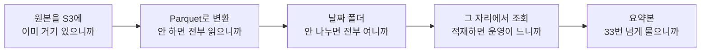

[1편](/posts/2026-09-16-analytics-tools-first-look/)을 이렇게 시작했다.

> 쓰는 데는 지장이 없었다. 지장이 없어서 더 이상했다.
> 고칠 줄은 아는데 왜 이 모양인지는 설명을 못 한다.
> 그건 아는 게 아니라 익숙해진 것에 가깝다.

그래서 회사 구조를 안 보고, 요구사항만 놓고 처음부터 세워보기로 했다.
여덟 편이 걸렸다.

이제 돌아와서 설명이 되는지 볼 차례다.

## 먼저 밝혀둘 것

**회사의 실제 구조는 이 글에 적지 않는다.**
여기 적는 건 혼자 세우면서 내린 판단과, 그게 뭘 설명해줬는지까지다.

그리고 그 판단은 **지금 우리 규모 기준**이다.
5편에서 하루 5,000건으로 줄였더니 답이 전부 같아진 것처럼,
규모가 다르면 같은 실험이 다른 답을 낸다.

## 여덟 편에서 나온 숫자

| 편 | 무엇을 쟀나 | 결과 |
|---|---|---|
| 4 | 같은 데이터, 네 가지 모양 | 읽는 양 92.0MB → 19KB |
| 4 | 같은 하루를 1,440개 파일로 | 시간 122배, 용량 3배 |
| 4 | 필드 이름이 바뀐 뒤 | 10만 건 읽고 5만 건으로 계산 |
| 5 | 같은 하루, 일곱 가지 질문 | 파일 1개 / 7개, 답이 세 가지 |
| 5 | 같은 파일, 다른 SELECT | 1.7MB → 19KB |
| 5 | 미리 세어두기 | 33번째 질문부터 싸짐 |
| 6 | 도구 쪽만 30분 끊기 | 2.2% 모자란 숫자, 알림 없음 |
| 6 | 멱등 열쇠 없이 재전송 | 1,137건 → 2,274건 |
| 7 | 어제 밤 스냅샷으로 오늘 답하기 | 매출 14.5% 높게 |
| 7 | 운영 DB 직접 조인 부하 | **재현 실패** |
| 8 | 배치와 조회를 같은 자원에 | 조회 p95 7.3배 |
| 8 | 배치 몫을 묶으면 | 조회 회복, 배치 3.5배 감소 |

## 처음 질문에 답해본다

### 왜 이 단계가 있는가

여덟 편을 쌓으면서 알게 된 건, 대부분의 단계가
**그 순간에 제일 싼 선택이었다**는 것이다.

내가 세운 순서도 그랬다.

각 칸에 이유가 하나씩 붙어 있다.
그리고 그 이유는 전부 **바로 앞 단계에서 아팠던 것**이다.

한 번에 설계한 게 아니라 아픈 순서대로 쌓인 거였다.
지금 쓰고 있는 구조가 복잡해 보이는 것도 같은 이유일 것이다.

### 왜 하필 이 순서인가

이게 이번에 제일 크게 바뀐 생각이다.

처음엔 "좋은 설계"가 따로 있고 그걸 향해 간다고 생각했다.
해보니 아니었다. **앞 단계가 안 아프면 다음 단계를 할 이유가 없다.**

5편에서 요약본을 만드는 시점이 33번째 질문이라는 게 나왔는데,
그 숫자는 우리 데이터 크기에서 나온 거다.
질문이 하루 세 번 오는 곳에서 요약본을 만들면 그냥 손해다.

8편에서 자원을 나누는 것도 마찬가지다.
나누면 조회가 7배 빨라지는데, 운영할 게 하나 늘고 배치가 3.5배 덜 돈다.
그 문제가 안 왔으면 나누지 않는 게 맞다.

그래서 구조를 볼 때 물어야 할 게 바뀌었다.

**"왜 이렇게 했지"가 아니라 "그때 뭐가 아팠지"였다.**

### 지금 이상해 보이는 것들

이건 짐작이지만 적어둔다.

구조에서 어색해 보이는 자리는 대개 **그때는 없던 요구가 나중에 생긴 자국**이다.

4편에서 필드 이름을 못 바꾸게 정했는데, 그 규칙이 없던 시절에 만든 데이터는
지금도 옛날 이름을 달고 있을 것이다. 고치면 과거가 안 맞으니까.
그래서 이름이 어색한 컬럼이 남는다.

7편에서 스냅샷과 변경 로그 중 스냅샷부터 만들기로 했는데,
나중에 금액 질문이 생기면 변경 로그를 얹게 된다.
그러면 두 경로가 같이 남는다. 처음부터 그렇게 설계한 사람은 없다.

**설명이 안 되는 구조를 보면, 그게 만들어진 시점에 뭐가 없었는지를 물어야 한다.**

## 내가 틀렸던 것

### 근거로 들었던 걸 재현하지 못했다

[3편](/posts/2026-09-17-analytics-decision/)에서 운영 DB에 직접 조인하지 않는 이유로
"한 번 크게 도는 집계가 주문 조회를 몇 초씩 밀어내는 걸 본 적이 있다"고 썼다.

7편에서 그걸 재현하려다 실패했다.
5초짜리 자기 조인을 넷 동시에 던져도 주문 조회 p95가 그대로였다.
주문을 100만으로 올려도 마찬가지였다.

겪은 건 맞는데, **그때 아팠던 게 그것 때문이었는지는 확인이 안 됐다.**

결정은 안 바꿨지만 이유를 바꿔 썼다.
바꾼 이유가 더 확실하다. 운영 DB는 "지금"만 알고, 분석은 "그때"를 묻는다.
지워진 주문은 운영 DB에서 조회할 방법이 없다.

**"본 적 있다"와 "이것 때문이다"는 다른 말이었다.**

### 큰 숫자를 쫓다가 조용한 쪽을 놓칠 뻔했다

4편에서 4,800배가 나왔을 때 이게 제일 중요한 발견인 줄 알았다.
그런데 여덟 편을 다 쓰고 보니 같은 모양의 문제가 세 번 나왔다.

| 편 | 조용히 틀리는 자리 |
|---|---|
| 4 | 필드 이름이 바뀐 뒤 평균이 반쪽으로 계산됨. 에러 없음 |
| 6 | 도구가 끊겨 2.2% 낮은 숫자. 알림 없음 |
| 7 | 어제 밤 기준 매출이 14.5% 높음. 화면에 기준 시각 없음 |

셋 다 시스템은 멀쩡하고, 화면에는 그럴듯한 숫자가 나온다.

느린 건 누가 말해준다. 사람이 기다리다 못해 물어본다.
**틀린 건 아무도 말해주지 않는다.**

그래서 파이프라인을 만들 때 성능보다 먼저 정해야 할 게
"틀렸을 때 어떻게 아는가"라는 걸 이번에 알았다.

### 작게 확인하면 안 보이는 게 있다

5편에서 하루 5,000건으로 줄이니 일곱 가지 질문의 답이 전부 같아졌다.
자정 3초 전에 들어온 이벤트가 있어야 생기는 일이기 때문이다.

로컬에서 몇백 건으로 확인하고 넘어갔으면 그 편은 안 나왔다.

## 설계 연습을 해보고 알게 된 것

이건 파이프라인 이야기가 아니다.

**답을 보고 푸는 것과 직접 푸는 것의 차이가 생각보다 컸다.**

회사 구조를 펼쳐놓고 해설을 달았으면
"아 여기는 이래서 이렇게 했구나"로 끝났을 것이다. 그것도 배움이긴 하다.

직접 세우니까 다른 게 남았다.
**틀린 선택을 해보고 그게 왜 틀렸는지를 숫자로 봤다.**

- 하루만 열고 시각으로도 거르면 제일 꼼꼼할 줄 알았는데 2건을 놓쳤다 (5편)
- 도구 전송 실패를 던지게 했더니 원본이 비었다 (6편)
- 사람 수로 재니 0.3%p라 넘어갈 뻔했다 (7편)
- 배치를 1스레드로 조였더니 조회는 좋아지고 배치가 반토막 났다 (8편)

넷 다 해보기 전에는 몰랐다. 읽어서 알 수 있는 종류가 아니었다.

그리고 하나 더. **재현에 실패한 편이 제일 남는다.**
7편을 쓰면서 제일 불편했는데, 지금 돌아보면 그 편이 제일 값있다.
믿고 있던 걸 확인하려다 확인이 안 된 경험이 처음이었다.

## 이 시리즈가 안 다룬 것

정직하게 적어둔다.

**AWS에서 안 돌렸다.** 요금도, 지연 시간도, 관리형 서비스의 제약도 못 다뤘다.
Firehose 버퍼 설정이 실제로 어떻게 동작하는지, Athena 동시 실행 한도에 언제 걸리는지는
문서로만 안다.

**규모가 작다.** 하루 20만 건, 주문 100만 건까지만 해봤다.
7편에서 부하가 재현 안 된 것도 아마 여기서 온다.

**사람 쪽을 안 다뤘다.** 분석가가 실제로 어떻게 묻는지, 마케터가 어떤 화면을 보는지는
전부 내가 가정한 것이다. 5편에서 "창구를 열면 쿼리는 내가 안 쓴다"고 써놓고
정작 남이 쓰는 쿼리는 상상으로 만들었다.

## 다음에 할 것

시리즈는 여기서 닫는다. 이어서 볼 건 세 가지다.

**Firehose를 실제로 한 번 돌려본다.**
로컬에서 버퍼 크기를 내가 정했는데, 관리형 서비스에서 그게 어디까지 되는지는 모른다.
특히 KST 파티션을 만드는 부분이 문서대로 되는지 확인하고 싶다.

**틀렸을 때 아는 장치를 먼저 만들어본다.**
이번엔 만들고 나서 대조 장치를 붙였다. 순서를 바꿔보면 뭐가 달라지는지 궁금하다.

**규모를 열 배로 올려본다.**
7편에서 재현 못 한 것들이 그때는 보일지, 아니면 다른 게 원인이었는지.

---

1편에서 "왜 이 모양인지는 설명을 못 한다"로 시작했다.

지금은 설명할 수 있다.
그런데 설명이 된 이유가 구조를 알게 돼서가 아니라
**같은 자리에서 같은 선택을 해봤기 때문**이었다.

그러니 다음에 또 모르는 구조를 만나면 같은 걸 하면 된다.
읽지 말고 옆에 세워보는 것.

전체 코드는 [backend-lab](https://xo0449.github.io/backend-lab/)에 있다.
다섯 모듈 전부 명령 하나로 돌아간다.
