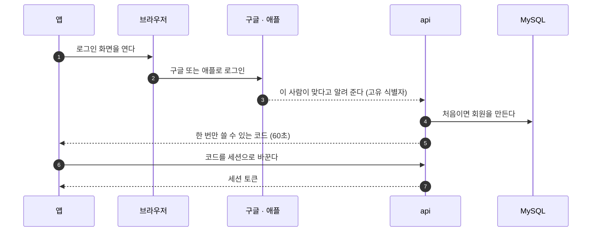
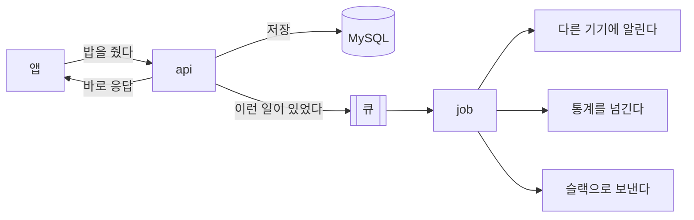
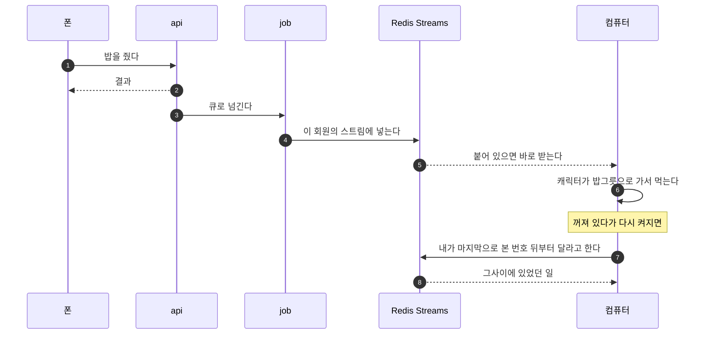

이번 편은 뽀모야의 서버 구조다. 전체 그림을 먼저 보이고, 그다음에 각 부분이 왜 이렇게 됐는지를 적는다.

클라이언트는 [1편](/posts/2026-10-06-pomoya-intro/)에서 이미 다뤘다. 그래서 여기서는 **클라이언트에서 출발한 요청이 어디를 지나가는지**를 따라가면서 설명한다. 그림의 번호가 요청이 지나가는 순서다.

## 1. 로그인: 직접 만들지 않고 구글과 애플에 맡겼다

클라이언트가 가장 먼저 해야 하는 일은 로그인이다. 누구의 캐릭터인지 알아야 저장도 하고 이어 쓰기도 할 수 있다. 그래서 요청은 먼저 로그인을 받아 줄 **api 서버**로 간다.

여기서 제일 먼저 고민한 건 기술이 아니라 **개인정보**였다.

회원가입을 직접 만들면 아이디와 비밀번호, 이메일, 경우에 따라 이름과 전화번호까지 우리 서버에 쌓인다. 개인정보를 갖게 되면 서비스에 붙는 제약이 한꺼번에 늘어난다. 개인정보 처리방침에 수집 항목과 보관 기간을 적어야 하고, 안전하게 보관할 책임이 생기고, 유출되면 그 책임을 져야 한다. 직장을 다니는 둘이서 감당하기에는 무거운 짐이다.

그래서 **자체 로그인을 만들지 않았다.** 구글과 애플의 로그인(SSO)만 쓰고, 회원을 확인하는 일은 전부 거기에 맡겼다. 우리 서버에는 최소한만 둔다.

| 서버에 두는 것 | 서버에 두지 않는 것 |
|---|---|
| 구글·애플이 알려 주는 고유 식별자 | 비밀번호 |
| 이메일 주소(없어도 된다) | 이름, 사진, 전화번호 |

비밀번호가 서버에 없으니 비밀번호가 유출될 일도 없다. 비밀번호 찾기, 본인 확인, 계정 도용 같은 문제도 구글과 애플이 풀어 준다.

흐름은 이렇다.

로그인 화면을 앱 안에 띄우지 않고 **바깥 브라우저로 여는 것**도 정한 것이다. 구글은 앱 안의 웹뷰에서 하는 로그인을 막고 있고, 이용자 입장에서도 평소 쓰던 브라우저에 이미 로그인돼 있어서 버튼 한 번이면 끝난다.

물론 대가는 있다. 구글과 애플에 **전부 기대게 된다.** 둘 중 하나가 정책을 바꾸면 따라가야 하고, 스토어에 올리려면 애플 로그인을 반드시 넣어야 하는 것 같은 조건도 받아들여야 한다. 그래도 개인정보를 직접 쥐는 것보다는 훨씬 가볍다고 봤다.

## 2. 이벤트: 한 곳으로 모아서 뒤에서 처리한다

로그인하고 나면 앱에서 일이 계속 생긴다. 집중을 시작했다, 끝냈다, 밥을 줬다, 물건을 샀다. 그리고 이런 일 하나가 일어날 때마다 서버가 해야 하는 뒷일이 딸려 온다.

- 다른 기기에 알려서 화면을 맞춘다
- 익명 통계를 넘긴다
- 신고가 들어오면 슬랙으로 보낸다

이걸 요청을 받은 자리에서 다 하면 문제가 생긴다. 밥 주기 버튼 하나를 눌렀는데 통계 서버가 느려서 응답이 늦어지거나, 슬랙이 잠깐 죽었다고 밥 주기가 실패하면 안 된다.

그래서 **이벤트를 한 곳으로 모으고 뒤에서 처리하는 장치**가 필요했다. api는 판정하고 저장한 다음 "이런 일이 있었다"를 큐에 넣고 바로 응답한다. 뒷일은 **job**이라는 별도 프로세스가 큐에서 꺼내서 한다.

큐는 **BullMQ**로 만들었다. 같이 놓고 본 것들은 이렇다.

| 후보 | 버린 이유 |
|---|---|
| Kafka | 이 규모에는 너무 크다. 홈서버 한 대에 올리기에는 무겁고, 둘이서 돌보기에도 벅차다 |
| Redis Streams를 직접 큐로 | 재시도, 나중에 실행하기, 실패한 작업 보관을 전부 직접 만들어야 한다 |
| AWS SQS | 지금은 홈서버다. AWS로 옮길 때 다시 본다 |

BullMQ는 Redis 하나만 있으면 돌고, 재시도와 지연 실행과 반복 실행이 이미 들어 있다. 큐에 뭐가 쌓여 있고 뭐가 실패했는지 볼 수 있는 대시보드도 딸려 있다.

한 가지 신경 쓴 것이 있다. **저장은 됐는데 큐에 넣는 게 실패하면** 그 일은 영영 사라진다. 그래서 api는 상태를 저장할 때 "큐에 넣을 것"도 같은 트랜잭션으로 MySQL에 적어 둔다. 큐에 넣는 데 실패해도 기록이 남아 있으니, 1분마다 도는 작업이 못 넣은 것을 찾아서 다시 넣는다.

## 3. api는 알리기만 하고, 공통 로직은 전부 job이 맡는다

위 그림에서 강조하고 싶은 게 하나 있다. **api는 "이런 일이 있었다"를 발행하는 데까지만 한다.** 그 뒤에 벌어지는 일, 그러니까 다른 기기에 알리고, 통계를 넘기고, 슬랙으로 보내고, 정리하는 공통 로직은 **전부 job에 있다.** api에는 그런 코드를 두지 않는다.

"그냥 api에서 다 하면 안 되나" 싶을 수 있다. 실제로 그쪽이 만들기는 더 쉽다. 그런데 api에 모든 역할을 주면 안 되는 이유가 있다.

**api는 이용자가 기다리고 있는 자리다.** api가 받는 요청 뒤에는 화면 앞에서 결과를 기다리는 사람이 있다. 여기서 슬랙을 부르고 통계를 보내면, 그 바깥 서비스가 느려진 만큼 이용자의 화면도 느려진다. 바깥 서비스가 죽으면 밥 주기가 실패한다. 이용자와 아무 상관없는 일 때문에 이용자가 피해를 본다.

**무거운 일이 가벼운 요청을 막는다.** 서버는 Node.js로 돌고, Node.js는 한 번에 한 가지 일을 한다. api가 수만 줄을 지우는 정리 작업이나 리포트 계산을 직접 하면, 그동안 들어온 로그인과 밥 주기 요청이 전부 줄을 선다. job을 다른 프로세스로 떼어 두면 뒤에서 아무리 무거운 일을 해도 api의 응답은 영향을 받지 않는다.

**같은 일을 시키는 입구가 여러 개다.** 예를 들어 "탈퇴한 계정의 흔적을 지운다"는 일은 이용자가 탈퇴 버튼을 눌렀을 때도 필요하고, 밤에 도는 정리 배치에서도 필요하다. 이 로직이 api에 있으면 배치가 api를 흉내 내야 하거나 같은 코드를 두 군데에 두게 된다. job에 한 번만 두면 이벤트로 오든 배치로 오든 같은 코드를 탄다.

**바깥으로 나가는 문이 하나가 된다.** 슬랙 주소, 푸시 인증 키 같은 비밀값은 바깥 서비스를 부르는 쪽이 갖고 있어야 한다. api는 인터넷에 열려 있는 프로세스라서 비밀값을 적게 가질수록 좋다. 바깥을 부르는 일을 job에만 두면 그런 비밀값은 job만 가지면 되고, 바깥 서비스가 바뀌었을 때 고칠 곳도 한 군데다.

**재시도와 중복 방지를 한 번만 만든다.** 바깥 서비스는 언제든 실패한다. 실패하면 다시 시도해야 하고, 다시 시도하다가 같은 알림이 두 번 가면 안 된다. 이걸 api의 기능마다 따로 만들면 기능 수만큼 구현이 생긴다. job에 모으면 큐가 주는 재시도를 전부 같이 쓴다.

**재시작해도 일이 사라지지 않는다.** api는 배포할 때마다 다시 뜬다. 요청을 처리하다가 뒷일을 하는 도중에 꺼지면 그 일은 그냥 사라진다. 큐에 넣어 둔 일은 프로세스가 죽어도 남아 있어서, 다시 뜨면 이어서 한다.

나눠 보면 이렇다.

| | api | job |
|---|---|---|
| 하는 일 | 요청을 받고, 판정하고, 저장하고, 알린다 | 알림을 받아 뒷일을 한다 |
| 누가 기다리나 | 화면 앞의 이용자 | 아무도 기다리지 않는다 |
| 빨라야 하나 | 그렇다 | 조금 늦어도 된다 |
| 실패하면 | 이용자에게 바로 실패를 알린다 | 다시 시도한다 |
| 바깥 서비스 | 부르지 않는다 | 여기서만 부른다 |

솔직히 이 원칙은 지키기가 쉽지 않다. 신고 기능을 만들 때 처음에는 api가 슬랙을 직접 부르게 만들었다. 한 줄이면 되니까 그게 제일 빨랐다. 그런데 그렇게 해 놓고 보니 위에 적은 문제가 그대로 나왔고, 결국 큐를 거쳐 job이 보내는 구조로 되돌렸다. "이건 간단하니까 api에서 바로 하자"가 한 번 들어가면 두 번째, 세 번째가 금방 따라온다. 그래서 간단한 것도 예외 없이 job으로 보낸다.

## 4. 배치: 같은 큐를 쓰되, 끊어서 처리한다

이벤트만 큐로 도는 게 아니다. **정해진 시간에 도는 배치**도 같은 Redis와 BullMQ를 쓴다. 만료된 로그인 정보 지우기, 오래된 기록 정리, 탈퇴한 계정 지우기, 통계 리포트 만들기 같은 것들이다.

배치를 따로 만들지 않고 큐에 태운 이유는 단순하다. 돌볼 것을 늘리고 싶지 않았다. 큐 하나만 들여다보면 이벤트도 배치도 다 보인다.

그런데 이렇게 하니 걱정이 하나 생겼다. 이벤트와 배치가 **같은 Redis, 같은 서버**를 쓴다. 이용자가 늘어서 지울 것이 수만 줄이 됐을 때 배치가 한 번에 다 지우려고 하면, 그동안 서비스가 느려질 수 있다.

그래서 **끊어서 처리한다.** 쌓인 것을 한 번에 처리하지 않고, 정해진 크기로 자르고, 자른 것마다 따로 끝내고, 어디까지 했는지 남긴다.

| 어디서 | 한 번에 얼마나 | 중간에 실패하면 |
|---|---|---|
| 앱이 쌓아 둔 행동을 올릴 때 | 요청 하나에 50개 | 거절된 것만 되돌린다. 끊기면 같은 것을 다시 보낸다 |
| 집중 기록을 받아 갈 때 | 200줄씩 | 받은 데까지는 남는다 |
| 정리 배치 | 1,000줄씩, 사이사이 쉰다 | 지운 데까지는 남는다 |
| job이 큐에서 꺼낼 때 | 동시에 5개까지 | 그 작업만 다시 시도한다 |

**재시도는 직접 만들지 않고 BullMQ에 맡겼다.** 실패하면 간격을 점점 늘려 가며 다시 시도하고, 끝까지 안 되면 실패한 작업으로 남겨 둔다. 지우지 않고 남겨 두는 게 중요하다. 그래야 나중에 뭐가 왜 실패했는지 볼 수 있다. 실패한 작업이 쌓이면 슬랙으로 알림이 온다.

## 5. Redis를 고른 이유

여기까지 읽으면 Redis가 꽤 많은 일을 한다는 게 보인다. 큐도 Redis고 배치도 Redis다.

Redis를 고른 이유는 **기획이 바뀌어도 계속 쓸 수 있는 것**이 필요했기 때문이다.

[2편](/posts/2026-10-06-pomoya-planning-and-design/)에 적었듯이 뽀모야의 기획은 계속 바뀌었다. 진짜 데이터는 표 구조가 정해진 MySQL에 두지만, 그 옆에는 구조가 바뀌어도 부담 없이 쓸 수 있는 NoSQL이 하나 필요했다. 오늘은 큐로 쓰고, 내일은 실시간 전달에 쓰고, 다음에는 접속 중인 사람을 세는 데 쓸 수 있는 것.

특히 **Streams**가 결정적이었다. 이벤트를 순서대로 쌓아 두고 "여기서부터 다시 읽기"를 할 수 있는 구조인데, 이게 있으면 Kafka 같은 무거운 장비를 들이지 않아도 된다. Kafka는 좋은 도구지만 홈서버 한 대에서 둘이 돌리기에는 과하다. Redis는 이미 큐 때문에 띄워 놓았으니 추가로 돌볼 것도 없다.

다만 원칙은 하나 지킨다. **Redis는 진실이 아니다.** 진짜 데이터는 MySQL에만 있고, Redis가 통째로 날아가도 MySQL만으로 전부 되살릴 수 있어야 한다. Redis에는 다시 만들 수 있는 것만 둔다.

## 6. 실시간 연동: Streams로 처리한다

마지막은 실시간 연동이다. 폰에서 밥을 주면 컴퓨터의 캐릭터도 밥을 먹어야 한다. 폰에서 집중을 시작하면 컴퓨터에도 "폰에서 집중 중"이 떠야 한다.

이것도 Streams로 한다. job이 이벤트를 처리하면서 그 회원의 스트림에 "이런 일이 있었다"를 넣고, 기기는 그걸 받아서 화면을 맞춘다.

여기서 Streams의 장점이 나온다. 그냥 "지금 붙어 있는 기기에 뿌리기"만 하면, **꺼져 있던 사이의 일은 사라진다.** 컴퓨터를 덮어 뒀다가 다시 열면 그사이에 폰에서 한 일을 모른다. Streams는 최근 것을 쌓아 두고 있어서, 기기가 "내가 마지막으로 본 번호 뒤부터 줘"라고 하면 놓친 것을 이어서 받을 수 있다.

그리고 이 통로는 **받기 전용**이다. 이 통로로는 상태를 바꿀 수 없다. 상태를 바꾸는 길은 api에 요청을 보내는 것 하나뿐이다. 그래서 실시간 통로가 죽어도 앱은 그대로 돌아간다. 화면이 조금 늦게 맞춰질 뿐이다.

## 정리

| 부분 | 고른 것 | 이유 |
|---|---|---|
| 로그인 | 구글·애플 로그인만 | 개인정보를 직접 쥐지 않으려고. 서버에는 식별자와 이메일만 |
| 이벤트 처리 | 큐와 job (BullMQ) | 뒷일 때문에 응답이 늦어지거나 실패하지 않게 |
| 공통 로직 | api는 알리기만, 나머지는 job | 이용자가 기다리는 자리에 무거운 일과 바깥 호출을 두지 않으려고 |
| 배치 | 같은 큐에 태운다 | 돌볼 것을 늘리지 않으려고. 대신 끊어서 처리한다 |
| 재시도 | BullMQ에 맡긴다 | 직접 만들지 않는다. 실패한 것은 지우지 않고 남긴다 |
| Redis | 큐, 배치, 실시간 전달 | 기획이 바뀌어도 쓸 수 있고, Streams로 Kafka 없이 간다 |
| 실시간 연동 | Redis Streams | 꺼져 있던 사이의 일도 이어서 받는다 |

돌아보면 고른 기준은 거의 하나였다. **둘이서 돌볼 수 있는가.** 더 좋은 도구는 늘 있었지만, 돌볼 것이 하나 늘어날 때마다 만들 시간이 줄어든다. 그래서 새 장비를 들이기 전에 이미 있는 것으로 되는지부터 봤다.

다음 편은 캐릭터의 규칙이다. 배고픔은 무엇을 기준으로 줄어드는지, 얼마나 해야 자라는지, 그리고 왜 돈을 받지 않기로 했는지 적어보겠다.
