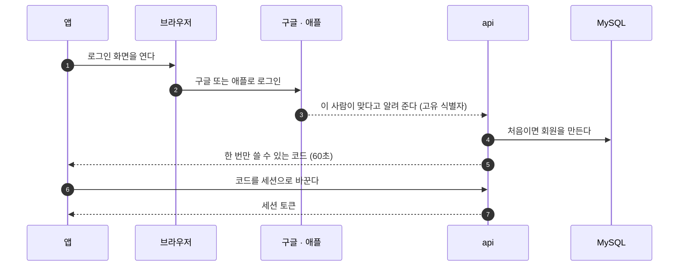
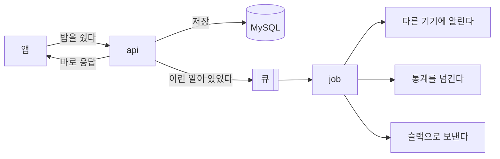
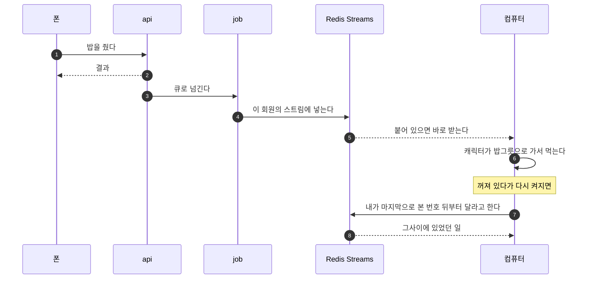

이번 편은 뽀모야의 서버 구조다. 전체 그림을 먼저 보이고, 그다음에 각 부분이 왜 이렇게 됐는지를 적는다.

클라이언트는 [1편](/posts/2026-10-06-pomoya-intro/)에서 이미 다뤘다. 그래서 여기서는 **클라이언트에서 출발한 요청이 어디를 지나가는지**를 따라가면서 설명한다. 그림의 번호가 요청이 지나가는 순서다.

## 1. 로그인: 직접 만들지 않고 구글과 애플에 맡겼다

클라이언트가 가장 먼저 해야 하는 일은 로그인이다. 누구의 캐릭터인지 알아야 저장도 하고 이어 쓰기도 할 수 있다. 그래서 요청은 먼저 로그인을 받아 줄 **api 서버**로 간다.

여기서 제일 먼저 고민한 건 기술이 아니라 **개인정보**였다.

회원가입을 직접 만들면 아이디와 비밀번호, 이메일, 경우에 따라 이름과 전화번호까지 우리 서버에 쌓인다. 개인정보를 갖게 되면 서비스에 붙는 제약이 한꺼번에 늘어난다. 개인정보 처리방침에 수집 항목과 보관 기간을 적어야 하고, 안전하게 보관할 책임이 생기고, 유출되면 그 책임을 져야 한다. 직장을 다니는 둘이서 감당하기에는 무거운 짐이다.

그래서 **자체 로그인을 만들지 않았다.** 구글과 애플의 로그인(SSO)만 쓰고, 회원을 확인하는 일은 전부 거기에 맡겼다. 우리 서버에는 최소한만 둔다.

| 서버에 두는 것 | 서버에 두지 않는 것 |
|---|---|
| 구글·애플이 알려 주는 고유 식별자 | 비밀번호 |
| 이메일 주소(없어도 된다) | 이름, 사진, 전화번호 |

비밀번호가 서버에 없으니 비밀번호가 유출될 일도 없다. 비밀번호 찾기, 본인 확인, 계정 도용 같은 문제도 구글과 애플이 풀어 준다.

흐름은 이렇다.

로그인 화면을 앱 안에 띄우지 않고 **바깥 브라우저로 여는 것**도 정한 것이다. 구글은 앱 안의 웹뷰에서 하는 로그인을 막고 있고, 이용자 입장에서도 평소 쓰던 브라우저에 이미 로그인돼 있어서 버튼 한 번이면 끝난다.

물론 대가는 있다. 구글과 애플에 **전부 기대게 된다.** 둘 중 하나가 정책을 바꾸면 따라가야 하고, 스토어에 올리려면 애플 로그인을 반드시 넣어야 하는 것 같은 조건도 받아들여야 한다. 그래도 개인정보를 직접 쥐는 것보다는 훨씬 가볍다고 봤다.

## 2. 이벤트: 한 곳으로 모아서 뒤에서 처리한다

로그인하고 나면 앱에서 일이 계속 생긴다. 집중을 시작했다, 끝냈다, 밥을 줬다, 물건을 샀다. 그리고 이런 일 하나가 일어날 때마다 서버가 해야 하는 뒷일이 딸려 온다.

- 다른 기기에 알려서 화면을 맞춘다
- 익명 통계를 넘긴다
- 신고가 들어오면 슬랙으로 보낸다

이걸 요청을 받은 자리에서 다 하면 문제가 생긴다. 밥 주기 버튼 하나를 눌렀는데 통계 서버가 느려서 응답이 늦어지거나, 슬랙이 잠깐 죽었다고 밥 주기가 실패하면 안 된다.

그래서 **이벤트를 한 곳으로 모으고 뒤에서 처리하는 장치**가 필요했다. api는 판정하고 저장한 다음 "이런 일이 있었다"를 큐에 넣고 바로 응답한다. 뒷일은 **job**이라는 별도 프로세스가 큐에서 꺼내서 한다.

큐는 **BullMQ**로 만들었다. 같이 놓고 본 것들은 이렇다.

| 후보 | 버린 이유 |
|---|---|
| Kafka | 이 규모에는 너무 크다. 홈서버 한 대에 올리기에는 무겁고, 둘이서 돌보기에도 벅차다 |
| Redis Streams를 직접 큐로 | 재시도, 나중에 실행하기, 실패한 작업 보관을 전부 직접 만들어야 한다 |
| AWS SQS | 지금은 홈서버다. AWS로 옮길 때 다시 본다 |

BullMQ는 Redis 하나만 있으면 돌고, 재시도와 지연 실행과 반복 실행이 이미 들어 있다. 큐에 뭐가 쌓여 있고 뭐가 실패했는지 볼 수 있는 대시보드도 딸려 있다.

한 가지 신경 쓴 것이 있다. **저장은 됐는데 큐에 넣는 게 실패하면** 그 일은 영영 사라진다. 그래서 api는 상태를 저장할 때 "큐에 넣을 것"도 같은 트랜잭션으로 MySQL에 적어 둔다. 큐에 넣는 데 실패해도 기록이 남아 있으니, 1분마다 도는 작업이 못 넣은 것을 찾아서 다시 넣는다.

## 3. api는 알리기만 하고, 공통 로직은 전부 job이 맡는다

위 그림에서 강조하고 싶은 게 하나 있다. **api는 "이런 일이 있었다"를 발행하는 데까지만 한다.** 그 뒤에 벌어지는 일, 그러니까 다른 기기에 알리고, 통계를 넘기고, 슬랙으로 보내고, 정리하는 공통 로직은 **전부 job에 있다.** api에는 그런 코드를 두지 않는다.

"그냥 api에서 다 하면 안 되나" 싶을 수 있다. 나도 그렇게 생각했고, 실제로 그쪽이 만들기는 훨씬 쉽다. 그런데 하나씩 따져 보니 api한테 다 맡기면 안 되는 이유가 꽤 많았다.

제일 먼저 떠올린 건 이용자가 기다리는 시간이었다. api로 들어오는 요청 뒤에는 화면 앞에서 결과를 기다리는 사람이 있다. 밥 주기 버튼을 눌렀는데 그 요청 안에서 슬랙도 부르고 통계도 보내고 있으면, 슬랙이 느린 날에는 밥 주기도 같이 느려진다. 슬랙이 아예 죽은 날에는 밥 주기가 실패한다. 이용자 입장에서는 슬랙이 뭔지도 모르는데 캐릭터한테 밥을 못 주는 것이다. 이건 좀 억울하다.

두 번째는 무거운 일이 가벼운 요청을 밀어내는 문제다. Node.js는 기본적으로 한 번에 한 가지 일만 하기 때문에, api가 리포트 계산 같은 무거운 일을 직접 붙잡고 있으면 그동안 들어온 로그인이나 밥 주기가 뒤에 줄을 선다. 다만 이건 직접 재 보니 생각만큼 크지는 않았다. 100만 줄을 읽어 합계를 내는 일을 api와 같은 프로세스에서 돌려도, 1,000줄씩 끊어서 하면 가벼운 요청의 최대 응답 시간이 9ms였다(아무 일도 없을 때 7ms, 다른 프로세스로 뗐을 때 7ms). 한 번에 다 읽을 때만 25ms까지 튀었다. 프로세스를 나누는 것보다 **끊어서 하는 것**이 먼저라는 걸 이때 알았다.

만들다 보니 알게 된 것도 있다. 같은 일을 시키는 입구가 생각보다 여러 개였다. 예를 들어 탈퇴한 계정의 흔적을 지우는 일은 이용자가 탈퇴 버튼을 눌렀을 때도 해야 하고, 밤에 도는 정리 배치에서도 해야 한다. 이 코드가 api 안에 있으면 배치가 api를 흉내 내서 부르거나, 똑같은 코드를 두 군데에 복사해 둬야 한다. 복사해 둔 코드는 언젠가 한쪽만 고치게 되고 그때부터 버그가 된다. job에 한 번만 써 두면 버튼으로 오든 배치로 오든 같은 코드를 탄다.

비밀값 문제도 있었다. 슬랙에 보내려면 슬랙 주소가 있어야 하고, 아이폰에 푸시를 보내려면 인증 키가 있어야 한다. 이런 값은 바깥 서비스를 부르는 쪽이 들고 있어야 하는데, api는 인터넷에 그대로 열려 있는 프로세스다. 밖에 열려 있는 쪽은 들고 있는 게 적을수록 마음이 편하다. 바깥을 부르는 일을 전부 job으로 몰아 두니 그런 값은 job만 알면 됐고, 나중에 슬랙 채널을 바꿀 때도 고칠 곳이 한 군데였다.

그리고 바깥 서비스는 반드시 실패한다. 언젠가는 꼭 실패한다. 그러면 다시 시도해야 하는데, 다시 시도하다가 같은 알림이 두 번 가면 그것도 문제다. 이걸 api의 기능마다 따로 만들면 기능이 열 개일 때 재시도 코드도 열 벌이 된다. job에 모아 두면 큐가 원래 해 주는 재시도를 전부 같이 쓰면 된다. 내가 만들 건 "이 일은 두 번 해도 괜찮은가"를 확인하는 것뿐이다.

마지막은 배포할 때 깨달았다. api는 코드를 올릴 때마다 꺼졌다가 다시 뜬다. 요청을 처리하고 뒷일을 하던 도중에 꺼지면 그 일은 그냥 사라진다. 아무도 모르게. 큐에 넣어 둔 일은 프로세스가 죽어도 그대로 남아 있어서, 다시 뜨면 거기서부터 이어서 한다. 하루에도 몇 번씩 배포하는 처지에서는 이게 꽤 든든하다.

나눠 보면 이렇다.

| | api | job |
|---|---|---|
| 하는 일 | 요청을 받고, 판정하고, 저장하고, 알린다 | 알림을 받아 뒷일을 한다 |
| 누가 기다리나 | 화면 앞의 이용자 | 아무도 기다리지 않는다 |
| 빨라야 하나 | 그렇다 | 조금 늦어도 된다 |
| 실패하면 | 이용자에게 바로 실패를 알린다 | 다시 시도한다 |
| 바깥 서비스 | 부르지 않는다 | 여기서만 부른다 |

솔직히 이 원칙은 지키기가 쉽지 않다. 신고 기능을 만들 때 처음에는 api가 슬랙을 직접 부르게 만들었다. 한 줄이면 되니까 그게 제일 빨랐다. 그런데 그렇게 해 놓고 보니 위에 적은 문제가 그대로 나왔고, 결국 큐를 거쳐 job이 보내는 구조로 되돌렸다. "이건 간단하니까 api에서 바로 하자"가 한 번 들어가면 두 번째, 세 번째가 금방 따라온다. 그래서 간단한 것도 예외 없이 job으로 보낸다.

### 그러면 job이 느려지면 똑같이 느려지는 것 아닌가

여기까지 쓰고 나면 이런 의문이 든다. api가 뒷일을 job한테 넘겼는데, job이 밀리면 결국 화면에 반영되는 것도 늦어지는 것 아닌가.

반은 맞다. 늦어지는 것은 있다. 다만 **누가 늦어지는가**가 다르다.

밥 주기를 누른 사람의 화면은 job을 기다리지 않는다. 판정하고 저장하는 것까지는 api가 하고, 그 결과를 바로 돌려준다. job이 하는 건 그 뒤의 일, 그러니까 다른 기기에 알리고 통계를 넘기는 일이다. job이 밀리면 늦어지는 건 "폰에서 준 밥이 컴퓨터 화면에 나타나는 시점"이지, 밥을 준 사람의 화면이 아니다.

말로만 하면 믿기 어려우니 재 봤다. 뒷일 하나가 200ms 걸리는 바깥 호출이라고 치고, 요청 1,000건을 보냈다.

| 뒷일을 어디서 하나 | 응답 p50 | 응답 p95 | 1초에 받는 요청 |
|---|---|---|---|
| 요청 안에서 한다 | 207ms | 214ms | 48건 |
| 큐에 넣고 job이 한다 | 4ms | 9ms | 2,116건 |

그다음이 진짜 궁금했던 부분이다. job이 감당하지 못할 만큼 몰려오면 어떻게 되나. job이 1초에 25건을 처리할 수 있게 해 두고, 들어오는 속도를 바꿔 봤다.

| 들어오는 속도 | 누른 사람의 응답 p95 | 뒷일이 끝나기까지 p95 |
|---|---|---|
| 1초에 20건 (job이 감당하는 범위) | 12ms | 0.2초 |
| 한꺼번에 1,000건 (job의 80배) | 9ms | 39초 |

몰려왔을 때 뒷일은 39초까지 밀렸다. 그런데 그동안에도 누른 사람의 응답은 9ms였다. 다른 기기에 퍼지는 건 늦어졌지만 서비스가 멈추지는 않았다. 뒷일을 요청 안에서 했다면 이 39초가 그대로 이용자가 기다리는 시간이 됐을 것이다.

그리고 밀린 것은 따라잡을 수 있다. job을 하나 더 띄우거나 동시에 처리하는 수를 늘리면 된다. api는 건드릴 필요가 없다. 지금은 api가 하는 일이 많지 않아서 이런 걱정이 과해 보일 수 있는데, 서비스가 계속되면 뒷일은 늘어나기만 한다. 나중에 떼어 내는 것보다 처음부터 떼어 두는 쪽이 쌌다.

이렇게 나누면서 얻은 게 하나 더 있다. api는 **"무슨 일이 일어났는가"**만 정하고, job은 **"그래서 무엇을 할 것인가"**를 맡는다. 이 둘이 떨어져 있으면 좋은 점이 꽤 있다.

새로운 반응을 붙일 때 api를 안 건드려도 된다. "집중이 끝났다"는 사건에 처음에는 다른 기기에 알리는 것만 있었는데, 나중에 아이폰 잠금화면 표시를 정리하는 일이 붙었다. api는 그대로 두고 job에 하나만 더했다.

반응 하나가 실패해도 나머지는 된다. 한 사건에 반응이 여럿이면 각각을 따로 돌린다. 하나가 실패했다고 이미 끝난 다른 반응까지 다시 하면, 다른 기기에서 밥 먹는 장면이 두 번 나온다.

그리고 무슨 일이 있었는지는 먼저 저장되고 반응이 그걸 읽어 간다. 반응 쪽에 버그가 있었어도 사건은 남아 있어서 고친 뒤에 다시 돌릴 수 있다.

> 이 글의 측정은 전부 내 노트북(M3 Pro)에서 MySQL과 Redis를 Docker로 따로 띄워서 한 것이다. 운영 서버에서 잰 값이 아니다. 숫자 자체보다 두 방식의 차이를 봐 주면 좋겠다. 위의 두 표는 한 번 재 본 값이고, 아래 배치 절의 표는 실험 코드를 공개해 둔 것이다.

## 4. 배치: 같은 큐를 쓰되, 끊어서 처리한다

이벤트만 큐로 도는 게 아니다. **정해진 시간에 도는 배치**도 같은 Redis와 BullMQ를 쓴다. 만료된 로그인 정보 지우기, 오래된 기록 정리, 탈퇴한 계정 지우기, 통계 리포트 만들기 같은 것들이다.

배치를 따로 만들지 않고 큐에 태운 이유는 단순하다. 돌볼 것을 늘리고 싶지 않았다. 큐 하나만 들여다보면 이벤트도 배치도 다 보인다.

그런데 이렇게 하니 걱정이 하나 생겼다. 이벤트와 배치가 **같은 Redis, 같은 서버**를 쓴다. 이용자가 늘어서 지울 것이 수만 줄이 됐을 때 배치가 한 번에 다 지우려고 하면, 그동안 서비스가 느려질 수 있다.

그래서 **끊어서 처리한다.** 쌓인 것을 한 번에 처리하지 않고, 정해진 크기로 자르고, 자른 것마다 따로 끝내고, 어디까지 했는지 남긴다.

| 어디서 | 한 번에 얼마나 | 중간에 실패하면 |
|---|---|---|
| 앱이 쌓아 둔 행동을 올릴 때 | 요청 하나에 50개 | 거절된 것만 되돌린다. 끊기면 같은 것을 다시 보낸다 |
| 집중 기록을 받아 갈 때 | 200줄씩 | 받은 데까지는 남는다 |
| 정리 배치 | 1,000줄씩, 사이사이 쉰다 | 지운 데까지는 남는다 |
| job이 큐에서 꺼낼 때 | 동시에 5개까지 | 그 작업만 다시 시도한다 |

이것도 재 봤다. 이번에는 일부러 **낮은 사양**으로 맞췄다. MySQL과 Redis를 각각 CPU 1개, 메모리 1GB로 묶어 놓고 시작했다. 홈서버 한 대로 버티려면 넉넉한 장비를 가정하면 안 되기 때문이다. 실험 코드는 [여기 있다](https://xo0449.github.io/backend-lab/modules/chunked-writes/). 누구나 그대로 돌려 볼 수 있다.

표 하나에 100만 줄을 넣어 두고, 그 100만 줄을 전부 쓰는 작업을 두 가지 방식으로 돌렸다. 한 번은 **트랜잭션 하나로 전부**, 한 번은 **1,000건씩 트랜잭션을 끊어서**. 그리고 그동안 옆에서 서비스 요청을 계속 보냈다. 서비스 요청은 같은 표의 아무 줄 하나를 고치는 요청이다. 이용자가 누른 버튼 하나라고 보면 된다.

| 100만 건 | 방식 | 작업이 걸린 시간 | 서비스 요청이 가장 오래 기다린 시간 | 그동안 처리된 서비스 요청 |
|---|---|---|---|---|
| 고치기(upsert) | 한 번에 | 13.2초 | **13,034ms** | 192건 |
| | 1,000건씩 | 17.3초 | 40ms | 9,142건 |
| 지우기 | 한 번에 | 12.4초 | **12,183ms** | 171건 |
| | 1,000건씩 | 21.1초 | 73ms | 10,876건 |
| 새로 넣기 | 한 번에 | 9.8초 | 128ms | 4,419건 |
| | 1,000건씩 | 11.9초 | 43ms | 6,209건 |

한 번에 하면 작업 자체는 조금 더 빨리 끝난다. 대신 그 13초 동안 서비스 요청이 13초를 기다렸다. 트랜잭션 하나가 100만 줄을 붙잡고 있어서, 그 줄을 고치려는 요청은 트랜잭션이 끝날 때까지 줄을 설 수밖에 없다. 오른쪽 끝 칸을 보면 더 분명하다. 13초 동안 서비스 요청이 192건밖에 처리되지 못했다. 끊어서 하면 1,000줄을 처리할 때마다 놓아 주니까 그 사이사이로 서비스 요청이 들어가고, 같은 시간에 9,142건이 처리됐다.

정리하면 **작업 시간은 조금 늘고, 이용자가 느끼는 응답 시간은 그대로**다. 아무 작업도 안 돌 때 서비스 요청의 응답은 중간값 1.6ms, p95 4.3ms였다. 100만 건을 1,000건씩 고치는 동안에는 중간값 3.0ms, p95 6.2ms였다. 이용자 입장에서는 뒤에서 100만 건이 바뀌고 있다는 걸 알 수가 없다.

DB가 얼마나 붙잡혀 있었는지도 따로 봤다. MySQL이 직접 세고 있는 값을 작업 앞뒤로 읽었다.

| 100만 건 | 방식 | 트랜잭션 하나가 잡고 있던 줄 | 다른 요청이 잠금을 기다린 시간(합계) |
|---|---|---|---|
| 고치기(upsert) | 한 번에 | 1,021,765줄 | 38,676ms |
| | 1,000건씩 | 1,060줄 | 37ms |
| 지우기 | 한 번에 | 1,021,778줄 | 36,445ms |
| | 1,000건씩 | 1,060줄 | 25ms |

한 번에 하면 트랜잭션 하나가 100만 줄을 끝날 때까지 쥐고 있다. 끊어서 하면 한 번에 쥐는 건 1,000줄 남짓이다. 그 결과 다른 요청이 잠금을 기다린 시간이 39초에서 0.04초로 줄었다. 작업이 4초 더 걸리는 대신, 다른 요청이 기다린 시간은 천 분의 일이 됐다.

새로 넣기만 하는 경우는 차이가 작았다. 새 줄은 아직 아무도 쓰지 않으니 부딪힐 일이 없기 때문이다. 문제가 되는 건 **이미 쓰고 있는 줄을 한꺼번에 건드릴 때**다.

Redis도 같았다. 100만 건을 명령 하나로 넣으면 그 명령이 도는 동안 다른 명령이 551ms를 기다렸고, 1,000건씩 나눠 넣으면 9ms였다. 걸린 시간은 2.1초와 1.7초로, 오히려 나눈 쪽이 빨랐다. Redis는 한 번에 명령 하나만 처리하기 때문에 큰 명령 하나가 나머지를 전부 세운다.

### 1초에 1,000만 건이 몰려오면

여기서 한 번 더 극단으로 가 봤다. **1,000만 건이 1초 안에** 들어온다고 쳤다. 뽀모야가 이런 양을 받을 일은 없겠지만, 구조가 어디까지 버티는지는 알고 싶었다.

방식은 지금 구조 그대로다. 들어온 것을 1,000건짜리 묶음으로 큐에 넣고, job이 묶음 하나를 꺼낼 때마다 트랜잭션 하나로 쓴다. 사양은 위와 같이 CPU 1개, 메모리 1GB다. 그리고 견주려고 같은 1,000만 건을 트랜잭션 하나로도 써 봤다.

| 1,000만 건 | 받는 데 걸린 시간 | 전부 반영되기까지 | 서비스 요청이 가장 오래 기다린 시간 | 그동안 처리된 서비스 요청 |
|---|---|---|---|---|
| 트랜잭션 하나로 | - | 158초 | **157,425ms** | 412건 |
| 큐에 1,000건 묶음으로 | 0.3초 | 146초 | **165ms** | 26,038건 |

끝나는 시간은 비슷하다. 158초와 146초다. 다른 건 그동안이다. 한 번에 쓰면 서비스가 157초 동안 멈추고, 큐로 받으면 가장 오래 기다린 요청이 0.165초다. **같은 장비로 비슷한 시간에 같은 일을 했는데, 한쪽은 서비스가 2분 반 동안 멈췄다.**

이 결과에서 내가 본 건 두 가지다.

하나는 **낮은 사양으로도 된다**는 것이다. CPU 1개짜리 MySQL이 1초에 7만 건쯤을 쓰면서 서비스를 같이 돌렸다. 장비를 키워서 버틴 게 아니라, 한 번에 쥐는 양을 1,000건으로 묶어 둔 덕이다. 큐가 "지금 못 하는 건 나중에 한다"를 맡아 주니까, 장비는 평소 양에 맞춰 두면 된다. 장비가 더 작으면 따라잡는 시간이 늘 뿐이다.

이걸 돈으로 바꿔 보면 차이가 더 잘 보인다. 아래는 **계산**이다. 클라우드에서 돌려 본 게 아니라 위에서 잰 값으로 셈한 것이다.

1,000만 건이 몰려온 그 1초 안에 전부 끝내려면, 잰 장비가 1초에 약 6만 8천 건을 썼으니 그 146배의 쓰기 능력이 있어야 한다. 서버 한 대를 키워서는 안 된다. 트랜잭션 하나는 CPU 하나만 쓰기 때문이다. 데이터를 146조각으로 나눠서 146대가 동시에 써야 하고, 그 146대는 몰려오지 않는 나머지 시간에는 논다.

| | 들어오는 즉시 끝내기 | 큐에 넣고 끊어 쓰기 |
|---|---|---|
| 필요한 서버 (같은 급으로) | 146대 | 1대 |
| 한 달 비용 (AWS EC2 t4g.small 서울, 대당 약 15달러) | 약 2,216달러 | 약 15달러 |
| 전부 반영되기까지 | 1초 | 146초 |

한 달에 약 2,200달러, 146배 차이다. 이 셈에는 가정이 깔려 있다. 잰 장비를 vCPU 2개에 메모리 2GB인 t4g.small 한 대로 쳤고(노트북의 CPU와 같은 속도인지는 재지 않았다), 146대가 정확히 146배를 쓴다고 쳤고, 가격은 2026년 10월 6일에 찾아본 값이다. 자세한 가정은 실험 글에 적어 뒀다.

그리고 가장 중요한 가정. **1,000만 건은 몰려오는 순간이지 계속 들어오는 양이 아니다.** 1초에 1,000만 건이 계속 들어오면 큐는 끝없이 쌓이기만 한다. 평균만큼은 쓸 수 있어야 한다. 큐가 해 주는 건 가장 몰릴 때에 맞춰 장비를 사지 않아도 되게 하는 것이다. 평균에 맞춰 사고, 몰릴 때는 늦게 끝낸다.

다른 하나는 그 대가다. 몰려온 동안 **반영이 146초 늦어졌다.** 비동기로 처리한다는 건 결국 이걸 받아들이는 것이다. 그런데 뽀모야는 이 대가가 유난히 작은 서비스다.

- 늦어지는 건 다른 기기에 퍼지는 것, 통계, 알림이다. 폰에서 준 밥이 컴퓨터 화면에 몇 초 늦게 나타난다고 곤란해지는 사람은 없다
- 정말 틀리면 안 되는 것, 그러니까 에너지가 충분한지와 보상이 두 번 들어가지 않는지는 api가 그 자리에서 판정하고 저장한다. 늦어지는 건 보여 주는 것이지 판정이 아니다
- 결제나 재고처럼 모두가 같은 순간에 같은 값을 봐야 하는 서비스가 아니다. 한 사람이 자기 캐릭터를 돌보는 앱이고, 같은 사람이 폰과 컴퓨터를 동시에 들여다보는 일도 드물다
- 늦어져도 결국 맞춰진다. 기기는 켤 때와 일정 간격으로 지금 상태를 직접 받아 간다

돈이 오가거나 실시간으로 겨루는 서비스였다면 이렇게 가볍게 정하지 못했을 것이다. 서비스의 성격이 구조를 싸게 만들어 준 셈이다.

**재시도는 직접 만들지 않고 BullMQ에 맡겼다.** 실패하면 간격을 점점 늘려 가며 다시 시도하고, 끝까지 안 되면 실패한 작업으로 남겨 둔다. 지우지 않고 남겨 두는 게 중요하다. 그래야 나중에 뭐가 왜 실패했는지 볼 수 있다. 실패한 작업이 쌓이면 슬랙으로 알림이 온다.

## 5. Redis를 고른 이유

여기까지 읽으면 Redis가 꽤 많은 일을 한다는 게 보인다. 큐도 Redis고 배치도 Redis다.

Redis를 고른 이유는 **기획이 바뀌어도 계속 쓸 수 있는 것**이 필요했기 때문이다.

[2편](/posts/2026-10-06-pomoya-planning-and-design/)에 적었듯이 뽀모야의 기획은 계속 바뀌었다. 진짜 데이터는 표 구조가 정해진 MySQL에 두지만, 그 옆에는 구조가 바뀌어도 부담 없이 쓸 수 있는 NoSQL이 하나 필요했다. 오늘은 큐로 쓰고, 내일은 실시간 전달에 쓰고, 다음에는 접속 중인 사람을 세는 데 쓸 수 있는 것.

특히 **Streams**가 결정적이었다. 이벤트를 순서대로 쌓아 두고 "여기서부터 다시 읽기"를 할 수 있는 구조인데, 이게 있으면 Kafka 같은 무거운 장비를 들이지 않아도 된다. Kafka는 좋은 도구지만 홈서버 한 대에서 둘이 돌리기에는 과하다. Redis는 이미 큐 때문에 띄워 놓았으니 추가로 돌볼 것도 없다.

다만 원칙은 하나 지킨다. **Redis는 진실이 아니다.** 진짜 데이터는 MySQL에만 있고, Redis가 통째로 날아가도 MySQL만으로 전부 되살릴 수 있어야 한다. Redis에는 다시 만들 수 있는 것만 둔다.

## 6. 실시간 연동: Streams로 처리한다

마지막은 실시간 연동이다. 폰에서 밥을 주면 컴퓨터의 캐릭터도 밥을 먹어야 한다. 폰에서 집중을 시작하면 컴퓨터에도 "폰에서 집중 중"이 떠야 한다.

이것도 Streams로 한다. job이 이벤트를 처리하면서 그 회원의 스트림에 "이런 일이 있었다"를 넣고, 기기는 그걸 받아서 화면을 맞춘다.

여기서 Streams의 장점이 나온다. 그냥 "지금 붙어 있는 기기에 뿌리기"만 하면, **꺼져 있던 사이의 일은 사라진다.** 컴퓨터를 덮어 뒀다가 다시 열면 그사이에 폰에서 한 일을 모른다. Streams는 최근 것을 쌓아 두고 있어서, 기기가 "내가 마지막으로 본 번호 뒤부터 줘"라고 하면 놓친 것을 이어서 받을 수 있다.

그리고 이 통로는 **받기 전용**이다. 이 통로로는 상태를 바꿀 수 없다. 상태를 바꾸는 길은 api에 요청을 보내는 것 하나뿐이다. 그래서 실시간 통로가 죽어도 앱은 그대로 돌아간다. 화면이 조금 늦게 맞춰질 뿐이다.

## 정리

| 부분 | 고른 것 | 이유 |
|---|---|---|
| 로그인 | 구글·애플 로그인만 | 개인정보를 직접 쥐지 않으려고. 서버에는 식별자와 이메일만 |
| 이벤트 처리 | 큐와 job (BullMQ) | 뒷일 때문에 응답이 늦어지거나 실패하지 않게 |
| 공통 로직 | api는 알리기만, 나머지는 job | 이용자가 기다리는 자리에 무거운 일과 바깥 호출을 두지 않으려고 |
| 배치 | 같은 큐에 태운다 | 돌볼 것을 늘리지 않으려고. 대신 끊어서 처리한다 |
| 재시도 | BullMQ에 맡긴다 | 직접 만들지 않는다. 실패한 것은 지우지 않고 남긴다 |
| Redis | 큐, 배치, 실시간 전달 | 기획이 바뀌어도 쓸 수 있고, Streams로 Kafka 없이 간다 |
| 실시간 연동 | Redis Streams | 꺼져 있던 사이의 일도 이어서 받는다 |

돌아보면 고른 기준은 거의 하나였다. **둘이서 돌볼 수 있는가.** 더 좋은 도구는 늘 있었지만, 돌볼 것이 하나 늘어날 때마다 만들 시간이 줄어든다. 그래서 새 장비를 들이기 전에 이미 있는 것으로 되는지부터 봤다.

다음 편은 캐릭터의 규칙이다. 배고픔은 무엇을 기준으로 줄어드는지, 얼마나 해야 자라는지, 그리고 왜 돈을 받지 않기로 했는지 적어보겠다.
